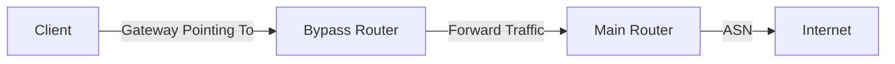
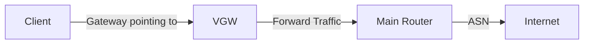

#  PPP PRIVATE NETWORK™ 2  
**Enterprise-grade Virtual Ethernet VPN Solution**  
Next-generation security network access technology, providing high-performance Virtual Ethernet tunneling service.

<div align="right" style="margin-top:-40px;">
  <kbd>
    <a href="README_CN.md">简体中文</a>
  </kbd>
  <kbd style="background:#0366d6;">
    <strong>English</strong>
  </kbd>
</div>

##  Core Technology Features

<div style="display: grid; grid-template-columns: repeat(2, 1fr); gap: 12px;">

<div>

-  **Synchronous Hyper-threaded IO Technology**  
-  **Full Coroutine + Multithread Architecture**  
-  **Supports Printable Plain Text Transmission**  
-  **Full Duplex/Half Duplex Tunnels**  
-  **VPN Virtual Subnet**  
-  **Port Mapping to Public Network P-NAT2**  
-  **Forward Proxy Support**  
-  **Virtual Firewall**  
-  **Virtual BGP Multi-line Diversion**  
-  **Domain Name Query Diversion**  
-  **Native Support for Soft Routers**  
-  **PaperAirplane Layering Technology**  
</div>

<div>

-  **Dual Network Protocol Stack Support**  
-  **Broadcast Support (Non-Unicast)**  
-  **Support for Multiple Tunnel Protocols**  
-  **MUX Multiplexing**  
-  **DNS Caching**  
-  **Dedicated Virtual Memory**  
-  **CDN Forwarding Support**  
-  **VPN Turbo**  
-  **TCP Fast Open**  
-  **Fixed Window Size Setting**  
-  **VPN Server Proxy Forwarding**  
-  **UDP Multi-line Bandwidth Aggregation**  

</div>

</div>

---

##  Platform Support
-  Windows
-  Linux
-  macOS
-  Android

##  Supported CPU Architectures
- **x86 Series**  
  i386 · x86_64
- **ARM Series**  
  armv7l · armv7a · aarch64
- **Other Architectures**  
  s390x · mipsel · ppc64el · riscv64

---

##  User License Agreement
### ✅ Authorized User Groups
<details open>
<summary>Click to view authorized user categories</summary>

1. 🎓 Academic Researchers  
2. 💻 Software Engineers  
3. 🌐 Network Engineers  
4. 🏢 Enterprise Users  
5. 🔬 Scientific and Technical Personnel  
6. 📦 Foreign Trade Users  
7. 🏛️ Government and Corporate Personnel  
8. 🎮 Gamers  
9. 🏬 Group Clients  
10. 🏣 Public Organizations  
11. ➰ Communication Technology  
12. ☁️ IT and Internet Users  
13. 🔒 Network Security Users  
14. 📝 Health Content Creators  
15. 🌍 Users outside Mainland China
</details>

> ⚠️ **Usage Restrictions Warning**  
>  **Use by other users violates the agreement**  
>  Unauthorized use will bear legal responsibility</img>

### ⚠️ Eight Categories of Prohibited Behaviors and Legal Details

#### 🚫 Classification and Legal Basis of Prohibited Behaviors  
| Behavior Type     | Specific Scenario                     | Legal Basis                                                                   | Technical Features                |  
|-------------------|----------------------------------------|-------------------------------------------------------------------------------|----------------------------------|  
| **Political Security** | Subverting the government/splitting | Article 105 of the Criminal Law (Subversion of State Power) | Communication via Tor dark web nodes/encrypted political channels |  
| **Pornography Crimes** | Child pornography/cross-border prostitution | Article 364 of the Criminal Law (Dissemination of Obscene Materials) + US FOSTA Act | Hash value matching/specific payment patterns |  
| **Gambling Operations** | Virtual currency casinos/money laundering | Article 303 of the Criminal Law (Gambling Crime) + Seychelles Gambling Act Article 45 | High-frequency small transfers/fixed odds interfaces |  
| **Drug Trafficking** | Dark web drug markets/poison tutorials | Article 347 of the Criminal Law (Drug Crime) + US Controlled Substances Act §841 | I2P network traffic/Bitcoin mixers |  
| **Human Trafficking** | Trafficking of labor/sexual exploitation | Article 240 of the Criminal Law (Trafficking in Women and Children) + UN Palermo Protocol | Fake recruitment websites/transnational communication groups |  
| **Financial Crimes** | Virtual currency laundering/selling "Four Pieces" | Article 191 of the Criminal Law (Money Laundering) + US Bank Secrecy Act | Dispersed aggregate transactions/Multilevel shell wallets |  
| **Telecom Fraud** | Impersonation of police/legal officers/scams | Article 38 of the Anti-Telecommunications Fraud Law + US FCC 47 CFR §64.1200 | VOIP spoofing/phishing page fingerprints |  
| **Illegal Transactions** | Forgery of KYC/user privacy sale | Article 66 of the Personal Information Protection Law + EU GDPR Article 83 | Database breaches/batch identity authentication requests |  

### ⚖️ Cross-Region Legal Supervision and Accountability Mechanism (Cross-border Judicial Enforcement Framework)

| **Jurisdiction** | **Law Enforcement Body** | **Core Legal Tools** | **Sentencing Standards** | **Cross-national Cooperation Mechanism** |  
|-------------------|--------------------------|-----------------------|------------------------|----------------------------------------|  
| **Mainland China** | Public Security Department Cybersecurity Bureau | Article 191 of the Criminal Law (Money Laundering) | - Money Laundering: **10 years imprisonment + 5 times involved amount fine**<br>- Harm to State Security: **Life imprisonment** | Via Interpol Red Notices for extradition |  
| **USA** | FBI Cyber Crime Division | Computer Fraud and Abuse Act (CFAA 18 U.S.C. §1030) | - Financial Crimes: **Up to 20 years imprisonment**<br>- Child Pornography: **Minimum 25 years mandatory** (mandatory sentencing) | Under the CLOUD Act for cross-border data requests |  
| **Seychelles** | FIU Financial Intelligence Unit | Anti-Money Laundering Law 2020, Article 15 | - Illegal gambling: **5 years imprisonment + $100,000 fine**<br>- Data crimes: **Daily $10,000 progressive fines** | Commonwealth judicial mutual assistance treaties for automatic enforcement |  

#### 🌐 Cross-border Investigation and Evidence Collection Process (GitHub Compatible Version)

##### ⏱️ Forensics Timeline
| Step | Initiator | Receiver | Action | Legal Basis | Time Limit |  
|-------|------------|----------|---------|--------------|------------|  
| 1 | National Security Authority | FBI | Share crime evidence chain | MLAT judicial assistance agreement | 72 hours |  
| 2 | FBI | Seychelles FIU | Issue freezing order for encrypted assets | Anti-Money Laundering Law 2020, Article 15 | Immediate |  
| 3 | Seychelles FIU | Cloud Service Provider | Execute data seizure order | Seychelles Criminal Justice Mutual Assistance Law, Article 8 | 72 hours |  
| 4 | Cloud Service Provider | Developer | Request judicial assistance (metadata only) | 18 U.S.C. § 2703(f) (Stored Communications Act) | 15 working days |  
| 5 | Developer | Interpol | Submit GitHub commit logs | GPL-3.0 Articles 15-17 (No Warrant Clause) | Immediate |  
| 6 | Interpol | Cross-border Courts | Submit joint blockchain evidence prosecution | United Nations Convention against Corruption, Article 46 | 30 days |  

##### 🔗 Key Evidence Handover Nodes
```diff
! Evidence Chain 1: Encrypted Asset Flow Map
+ Submitted to: Seychelles FIU
- Technical Means: Chainalysis on-chain tracing
# Legal Validity: 《Anti-Money Laundering Law 2020》 Annex 3

! Evidence Chain 2: GitHub Development Logs
+ Submitted to: INTERPOL Digital Crime Division
- Technical Verification: GPG signatures + Timestamps
# Legal Validity: The Hague Electronic Evidence Convention
```

### ⚠️ User Legal Risk Tips

+ **For Chinese Users:**  
   - Under Article 38 of the Anti-Telecommunications Fraud Law, involved accounts are **jointly frozen with family members' bank cards**  
   - Actions harming national security fall under Article 113 of the Criminal Law, **possible death penalty**  
   - Illegal cross-border data transmission triggers Article 45 of the Data Security Law, **up to 5 million RMB fine + license revocation**  

+ **For US Users:**  
   - The FBI initiates "Unilateral Jurisdiction" (based on USD settlement channels), **no extradition needed for direct prosecution**  
   - Child pornography cases invoke 18 U.S.C. §2251, **minimum 25-year sentence**  
   - Financial crimes apply the RICO Act, **asset confiscation**  

+ **For Seychelles Users:**  
   - Offshore company controllers are **personally unlimited liable** (Pierce Corporate Veil principle)  
   - Violations of Article 7 of the Anti-Money Laundering Law 2020 result in **$10,000 daily progressive fines**  
   - Dark web transactions under Article 88 of the ICT Law, **minimum 10-year sentence without parole**  

#### ⚠️ Real Cases of Consequences for Violations  

#### 💼 Virtual Currency Money Laundering Cases  
| Jurisdiction | Case Details | Penalty Results | Technical Evidence Methods |  
|----------------|----------------|------------------|------------------------------|  
| **Mainland China** | Zhao Dong Case (OTC merchant) | Fine **¥23 million** + **7 years imprisonment** | Chain analysis of mixer funds |  
| **USA** | BitMEX Exchange Case | CEO **30 months** imprisonment + $10 million personal fine | Analysis of Kraken exchange API logs |  
| **Seychelles** | OneCoin (VICoin) Ponzi Scheme | **Seized 35 offshore accounts** + globally wanted principal | SWIFT cross-border payment records analysis |  

#### 🎲 Cross-border Gambling Operations  
| Jurisdiction | Case Details | Penalty Results | Evidence Methods |  
|----------------|----------------|------------------|------------------|  
| **Mainland China** | Yabo Sports Platform Case | Recovered **¥3.8 billion** + **Life imprisonment** for main offenders | Alipay merchant transaction analysis |  
| **USA** | Bovada Gambling Platform | **Seized $100 million assets** + domain suspension | Cloudflare logs matching DDoS attack patterns |  
| **Seychelles** | Bet365 Seychelles Branch | **License revoked** + fine of **$3 million** | Server leasing contract tracing |  

#### 📊 Data Selling and Privacy Crimes  
| Jurisdiction | Case Details | Penalty Results | Evidence Methods |  
|----------------|----------------|------------------|------------------|  
| **Mainland China** | Koala Credit Investigation | CEO **3 years** + company **¥50 million** fine | Database access logs audit |  
| **USA** | Equifax Data Breach | **$700 million compensation** + permanent cybersecurity oversight | Exploit traffic analysis |  
| **Seychelles** | Seychelles Data Hub Case | **Forced liquidation** + executives extradited to US | AWS S3 access logs analysis |  

#### ⚠️ Compound Punishment Cases of Eight Types of Crimes  
| Case Name | Crime Composition | Punishment Results Across Three Countries |  
|-------------|---------------------|----------------------------------------------|  
| Galaxy International Case | Gambling + Money Laundering + Cross-border Payments | China: **Death sentence with reprieve**<br>US: **Seized NYC property**<br>Seychelles: **Deregistered 378 shell companies** |  
| DarkScandals Case | Child Pornography + Bitcoin Money Laundering + VPN Obfuscation | US: **175 years imprisonment for the first offender**<br>China: **Seized mining farms**<br>Seychelles: **Frozen $120M in crypto assets** |  

### 📜 Developer Disclaimer  
/* Validated by cross-jurisdictional judicial practice */  
1. **Technology Neutral Principle**  
   This tool is a network protocol pure technical implementation (RFC 8446 standard), developers:  
   - Do not operate any servers  
   - Do not store user traffic logs  
   - Do not provide commercial support services  

2. **Illegal Responsibility Separation Mechanism**  
   ```mermaid
   graph LR
      User_Actions-->ISP[Network Service Provider]
      Developer-->Code[GitHub Repository]
      Judicial_Forensics-->ISP
      Developer-.No_Access.->User_Actions
   ```

### ⚖️ Judicial Cooperation Limitation Statement  

#### 📜 Developer Compliance Cooperation Framework  
   ```mermaid
   graph LR
        A[Law Enforcement Request] --> B{Meets Legal Threshold}
        B -->|Yes| C[Provide Limited Materials]
        B -->|No| D[Written Rejection and Filing]
        C --> E[Record Material Delivery]
        D --> F[Judicial Remedy Procedures]
        classDef green fill:#d6f5d6,stroke:#28a745
        classDef red fill:#ffd6cc,stroke:#dc3545
        class C,E green
        class D,F red
   ```

### ⚖️ Cross-Jurisdiction Judicial Cooperation Details

| Jurisdiction | Legal Collection Threshold | Provided Materials | Delivery Time Limit | Refusal Basis |  
|----------------|------------------------------|----------------------|---------------------|--------------|  
| **Mainland China** | Provincial Cybersecurity Department "Evidence Retrieval Notice" + "Assistance Investigation Letter" | 1. GitHub commit history metadata<br>2. Code digital signature certificates<br>3. Open source license copies | 15 working days | Article 28 of the Cybersecurity Law |  
| **USA** | FISA Court Section 702 directive + DOJ endorsement | 1. PGP-signed files<br>2. CI/CD build logs<br>3. Third-party audit reports | 72 hours | Fourth Amendment + DMCA 512(f) |  
| **Seychelles** | Supreme Court Mutual Assistance Order + FIU Anti-Money Laundering Letter | 1. GPL-3.0 notarization<br>2. Contributor CLA agreement<br>3. Copyright registration | 30 calendar days | Article 41 of the Electronic Transactions Law |  

#### ⚠️ Non-cooperation Situations  
- No formal judicial documents, only oral/email requests  
- Requests for user traffic logs or communication content  
- Requests for non-public code design documents  
- Cross-border requests without Hague certification  
+ **Compliance Response**: Immediately activate the "Judicial Defense Plan" Chapter 7 process

### ⚔️ Judicial Cooperation Emergency Plan  
+ **Judicial Freeze Response**  
  Upon receiving forensic requests, execute immediately:  
  ```bash
  # Freeze GitHub repository to prevent modification
  gh api repos/liulilittle/openppp2/actions/permissions --method PUT -f enabled=false
  # Activate legal protection branch
  git checkout -b legal_lockdown
  git push origin --force legal_lockdown
  ```

### 🎣 Anti-Phishing Verification Process ###
```diff
+ Step1: Extract judicial document digital signature
+ Step2: Verify with CNNIC/GlobalSign root certificates
- Step3: If verification fails, immediately trigger judicial alert
! Step4: Send violation report to EFF
```

---

##  Command Line Interface
### ⚙️ General Commands

| Command | Function | Format | Default |
|---------|----------|--------|---------|
| `--rt` | Real-time mode | `--rt=[yes｜no]` | `yes` |
| `--dns` | Set DNS servers | `--dns <IP list>` | `8.8.8.8,8.8.4.4` |
| `--tun-flash` | Enable advanced QoS control | `--tun-flash=[yes｜no]` | `no` |
| `--pull-iplist` | Download country IP list | `--pull-iplist [file]/[country]` | `./ip.txt/CN` |
| `--config` | Configuration file path | `--config <file path>` | `./appsettings.json` |
| `--mode` | Run mode | `--mode=[client｜server]` | `server` |

> 🔗 **IP List Data Source**: [APNIC Official List](http://ftp.apnic.net/apnic/stats/apnic/delegated-apnic-latest)

---

### 🖥️ Server Commands

| Command | Function | Format | Default |
|---------|----------|--------|---------|
| `--firewall-rules` | Firewall rules file | `--firewall-rules <file>` | `./firewall-rules.txt` |

---

### 💻 Client Commands

#### Core Settings
| Command | Function | Format | Default |
|---------|----------|--------|---------|
| `--lwip` | [Protocol stack selection](#network-protocol-static-guide) | `--lwip=[yes｜no]` | Windows: `yes`<br>Others: `no` |
| `--vbgp` | Intelligent routing diversion | `--vbgp=[yes｜no]` | `yes` |
| `--nic` | Specify physical network card | `--nic <name>` | Auto |
| `--ngw` | Force gateway address | `--ngw <IP>` | Auto |

#### Virtual Network Card
| Command | Function | Format | Default |
|---------|----------|--------|---------|
| `--tun` | Network card name | `--tun <name>` | [Platform related](#network-card-name-default-guide) |
| `--tun-ip` | IP address | `--tun-ip <IP>` | `10.0.0.2` |
| `--tun-gw` | Gateway address | `--tun-gw <IP>` | [Platform related](#network-card-gateway-address-default-guide) |
| `--tun-mask` | Subnet mask | `--tun-mask <bits>` | `30` |
| `--tun-mask` | Preferred network | `--tun-host=[yes｜no]` | `yes` |

#### Advanced Features
| Command | Function | Format | Default |
|---------|----------|--------|---------|
| `--tun-mux` | MUX connection count | `--tun-mux <`[connections](#mux-connection-number-guide)`>` | `0` |
| `--tun-mux-acceleration` | MUX acceleration | `--tun-mux-acceleration <`[mode](#mux-acceleration-mode-guide)`>` | `0` |
| `--tun-vnet` | Subnet forwarding | `--tun-vnet=[yes｜no]` | `yes` |
| `--tun-ssmt` | Hyper-threading optimization | `--tun-ssmt=[`[thread count](#ssmt-threading-number-guide)`]/[`[mode](#ssmt-threading-optimize-mode-guide)`]` | `4/st` |
| `--tun-static` | [Static Tunnel](#udp-static-aggligator) | `--tun-static=[yes｜no]` | `no` |
| `--link-restart` | Link reconnection times | `--link-restart=[times]` | `0` |
| `--block-quic` | Block QUIC traffic | `--block-quic=[yes\|no]` | `no` |
| `--auto-restart` | Auto-restart program | `--auto-restart=[seconds]` | `0` |

#### Routing Settings
| Command | Function | Format | Default Value |
|---------|----------|--------|--------------|
| `--bypass` | Bypass list | `<file>` | `./ip.txt` |
| `--bypass-nic` | Specify interface for bypass list | `<network interface>` | |
| `--bypass-ngw` | Specify gateway for bypass list | `<IP>` | `0.0.0.0` |
| `--virr` | Auto-update and take effect | `[file]/[country]` | `./ip.txt/CN` |
| `--dns-rules` | DNS rules | `<file>` | [./dns-rules.txt](#dns-rules-guide) |

#### Platform Specific
| Command | Platform | Function | Format | Default |
|---------|---------|----------|--------|---------|
| `--tun-route` |  | Routing compatibility | `--tun-route=[yes｜no]` | `no` |
| `--tun-protect` |  | Routing protection | `--tun-protect=[yes｜no]` | `yes` |
| `--tun-promisc` |   | Promiscuous mode | `--tun-promisc=[yes｜no]` | `yes` |

---

### 🪟 Windows Commands

| Command | Function | Format |
|---------|----------|--------|
| `--system-network-reset` | Network reset | `--system-network-reset` |
| `--system-network-optimization` | Performance optimization | `--system-network-optimization` |
| `--system-network-preferred-ipv4` | Set IPv4 priority | `--system-network-preferred-ipv4` |
| `--system-network-preferred-ipv6` | Set IPv6 priority | `--system-network-preferred-ipv6` |
| `--no-lsp` | Disable LSP | `--no-lsp` |

---

## 📚 Global Parameters

<a id="mux-acceleration-mode-guide"></a>

###  MUX Acceleration Mode
| Value | Mode | Suitable Scene |
|:--:|------|----------------|
| 0 | Standard | General use |
| 1 | Server Acceleration | Download-intensive |
| 2 | Client Acceleration | Upload-intensive |
| 3 | Bi-directional Acceleration | High-performance needs |

<a id="network-card-name-default-guide"></a>

###  Virtual Network Card Default Values
| Platform | Default Value |
|----------|--------------|
| Windows | `PPP` |
| Linux | `ppp` |
| macOS | `utun0` |

<a id="network-card-gateway-address-default-guide"></a>

###  Virtual Gateway Server Default Values
| Platform | Default Value | Rules                     |
|----------|----------------|---------------------------|
| Windows  | `10.0.0.0`     | (IP & MASK)               |
| Linux    | `10.0.0.1`     | (IP & MASK) + 1           |
| macOS    | `10.0.0.1`     | (IP & MASK) + 1           |

<a id="ssmt-threading-optimize-mode-guide"></a>

###  SSMT Optimization Mode
| Mode | Optimization Direction |
|:--:|------------------------|
| st | Single connection large flow |
| mq | Multi-connection high concurrency |

<a id="symbol-explanation-guide"></a>

### 💾 Symbol Explanation
| Symbol | Description          |
|:-------|:---------------------|
| `[ ]`  | Optional parameter   |
| `< >`  | Required parameter   |
| `｜`   | Option separator     |
| `!`    | Not available / Disabled |

<a id="network-protocol-static-guide"></a>

### 🌐 Network Protocol Stack
| Type | Description |
|:--------:|--------------|
| `lwip` | Suitable for `Windows` |
| `ctcp` | Suitable for [!](#symbol-explanation-guide)`Windows` |

##  Compilation Guide

Must use a compiler that supports C++17, no other special requirements. Install a C++17 development environment in the standard way.

### Dependency Requirements
#### Minimum Dependencies  
- **Boost** >= 1.70 and <= 1.8.6
- **jemalloc** >= 5.30 (Android excluded)  
- **OpenSSL** >= 1.1.x  

#### Full Dependencies
- Boost  
- jemalloc  
- OpenSSL  
- cURL  

#### Resource Addresses  
- **cURL:** https://github.com/curl/curl  
- **jemalloc:** https://github.com/jemalloc/jemalloc  
- **openssl:** https://github.com/openssl/openssl  
- **Boost:** https://www.boost.org/releases/latest

### Platform Compilation Guide
| Platform | Toolchain | Recommended Method | Notes |
|----------|------------|----------------------|--------|
| **Windows** | Visual Studio 2022 | [vcpkg](https://github.com/microsoft/vcpkg) | Use static compilation (`/MT`, `/MTd`) |
| **Linux** | GCC/Clang | Manual compilation | [Reference script](https://github.com/liulilittle/openppp2/blob/main/.github/workflows/build-openppp2-for-linux-using-ubuntu-latest.yml) |
| **macOS** | LLVM-Clang | Manual compilation | [Reference script](https://github.com/liulilittle/openppp2/blob/main/.github/workflows/build-openppp2-for-darwin-using-macos-latest.yml) |
| **Android** | NDK r20b | Cross-compilation | [Reference script](https://github.com/liulilittle/openppp2/blob/main/.github/workflows/build-openppp2-for-android-using-ubuntu-latest-cross.yml) |

### Precompiled Library Resources
- **Linux**: [openppp2-ubuntu-3rd-environment](https://github.com/liulilittle/openppp2-ubuntu-3rd-environment)  
- **macOS**: [openppp2-macos-amd64-environment](https://github.com/liulilittle/openppp2-macos-amd64-environment)  
- **Android**: [openppp2-android-ndk-r20b-3rd-environment](https://github.com/liulilittle/openppp2-android-ndk-r20b-3rd-environment)  

### Environment Requirements
Must use a compiler supporting C++17, no other special requirements. Install a C++17 development environment in the standard way.

---

### Compilation Commands
1. **Set third-party library paths**  
   Modify `CMakeLists.txt` to specify dependency library directories:  
   `SET(THIRD_PARTY_LIBRARY_DIR /your/actual/path)`

2. **Compile and run**  
    ```bash
    # Linux/macOS compilation process
    mkdir build && cd build
    cmake .. -DCMAKE_BUILD_TYPE=Release
    make -j$(nproc)  # Linux automatically detects cores
    cd ../bin && ./ppp  # Run the program
    ```

### Preprocessor Macros
ANCIL_FD_BUFFER_STRUCT  
Enable sendfd/recvfd shared file descriptor parent fd protection mode

CURLINC_CURL  
Access HTTP/HTTPS resources via cURL library

TRANSMISSION_O1  
Force network transmission layer to use /O1 optimization

JEMALLOC  
Use jemalloc memory allocator instead of default

BUDDY_ALLOC_IMPLEMENTATION  
Use buddy allocator for virtual memory management

__MUSL__  
Statically link musl-libc C++ standard library (detached from GNU/Linux libc)

_LARGEFILE64_SOURCE  
Ensure musl-libc supports 64-bit file functions

### IO_URING Version Compilation
1. Download [liburing](https://github.com/axboe/liburing) source code and install
2. Uncomment the following in `CMakeLists.txt`:
   ```cmake
   # IF(PLATFORM_SYSTEM_LINUX) 
   #     ADD_DEFINITIONS(-DBOOST_ASIO_HAS_IO_URING=1)
   #     ADD_DEFINITIONS(-DBOOST_ASIO_DISABLE_EPOLL=1)
   # ENDIF()
   ```
3. Uncomment the # liburing.a line in TARGET_LINK_LIBRARIES:
   ```cmake
   TARGET_LINK_LIBRARIES(${NAME} 
       libc.a
       libssl.a 
       libcrypto.a 
       libjemalloc.a
       # liburing.a

       atomic
       dl
       pthread

       libboost_system.a
       libboost_coroutine.a 
       libboost_thread.a 
       libboost_context.a 
       libboost_regex.a
       libboost_filesystem.a) 
   ```
4. Follow the standard Linux build process

## 🚀 SIMD + AES_NI Optimization Implementation
### Optimization Algorithms
| Algorithm Name             | Implementation File Path                                                                                  |
|----------------------------|-----------------------------------------------------------------------------------------------------------|
| `simd-aes-128-cfb`     | [simd_aes_128_cfb.cpp](https://github.com/liulilittle/openppp2/blob/main/common/aesni/impl/simd_aes_128_cfb.cpp) |
| `simd-aes-256-cfb`     | [simd_aes_256_cfb.cpp](https://github.com/liulilittle/openppp2/blob/main/common/aesni/impl/simd_aes_256_cfb.cpp) |
| `simd-aes-128-gcm`     | [simd_aes_128_gcm.cpp](https://github.com/liulilittle/openppp2/blob/main/common/aesni/impl/simd_aes_128_gcm.cpp) |
| `simd-aes-256-gcm`     | [simd_aes_256_gcm.cpp](https://github.com/liulilittle/openppp2/blob/main/common/aesni/impl/simd_aes_256_gcm.cpp) |

**Prerequisites**  
1. Only support i386/amd64 platforms  
2. CPU must support AES-NI instruction set  
   (PPP automatically detects CPU support via assembly instructions)

**Compilation Steps**  
1. Modify `CMakeLists.txt`:  
   ```cmake
   SET(__SIMD__ TRUE)  # Original value FALSE
   ```
2. Follow standard Linux build process:
    ```bash
    mkdir build && cd build
    cmake .. -DCMAKE_BUILD_TYPE=Release
    make -j $(nproc) 
    ```

**Notes**  
- Only support i386/amd64; other platforms will fail to compile when enabled  
- CPU must support AES-NI instructions (PPP auto-detects)  
- Only optimize the following algorithms:  
  - `simd-aes-128-cfb`  
  - `simd-aes-256-cfb`  
  - `simd-aes-128-gcm`  
  - `simd-aes-256-gcm`  
- After modifying `CMakeLists.txt`, full recompile:
  ```bash
  rm -rf build && mkdir build && cd build
  cmake .. -DCMAKE_BUILD_TYPE=Release
  make clean && make -j $(nproc)
  ```

---

## 🌐 Configuration Files
### 🌍 Global Settings

| Parameter Name | Type   | Default Value | Description                                | Applicable             |
|------------------|--------|-----------------|--------------------------------------------|------------------------|
| concurrent       | int    | 1               | [Concurrency Thread Number](#concurrent-number-guide) | `client｜server`     |
| cdn              | array  | [80, 443]       | List of CDN ports                          | `server`               |

### 🔑 Encryption Settings (key)
| Parameter Name  | Type    | Example Value       | Description                     | Consistency | Applicable          |
|-----------------|---------|---------------------|---------------------------------|--------------|---------------------|
| kf              | int     | 154543927           | Key generation factor           | Mandatory    | `client｜server`   |
| kx              | int     | 128                 | Interleaving factor              | Optional     | `client｜server`   |
| kl              | int     | 10                  | Minimum NOP bits                 | Optional     | `client｜server`   |
| kh              | int     | 12                  | Maximum NOP bits                 | Optional     | `client｜server`   |
| sb              | int     | 1000                | Dynamic sliding window size (bytes) | Optional | `client｜server`   |
| protocol        | string  | aes-128-cfb         | Protocol layer encryption algorithm | Mandatory | `client｜server`   |
| protocol-key    | string  | N6HMzdUs7IUnYHwq    | Protocol layer encryption key   | Mandatory    | `client｜server`   |
| transport       | string  | aes-256-cfb         | Transport layer encryption algorithm | Mandatory | `client｜server`   |
| transport-key   | string  | HWFweXu2g5RVMEpy    | Transport layer encryption key  | Mandatory    | `client｜server`   |
| masked          | bool    | false               | Enable traffic obfuscation      | Mandatory    | `client｜server`   |
| plaintext       | bool    | false               | Allow plaintext transmission    | Mandatory    | `client｜server`   |
| delta-encode    | bool    | false               | Enable delta encoding           | Mandatory    | `client｜server`   |
| shuffle-data    | bool    | false               | Enable data randomization       | Mandatory    | `client｜server`   |

### 📡 Network Interfaces (ip)
| Parameter Name | Type   | Example Value   | Description                       | Applicable             |
|------------------|--------|-----------------|-----------------------------------|------------------------|
| public           | string | 192.168.0.24    | Public IP Address                 | `server`               |
| interface        | string | 192.168.0.24    | Local Listening Interface IP      | `server`               |

### 💾 Virtual Memory (vmem)
| Parameter | Type   | Example Value | Description                  | Applicable       | Platform           |
|-------------|--------|----------------|------------------------------|------------------|--------------------|
| size        | int    | 4096           | Memory pool size (MB)        | `client｜server` | `all`              |
| path        | string | "./{}"        | Path for memory file storage | `client｜server` | [!](#symbol-explanation-guide)`windows`         |

### 🔌 TCP Configuration
| Parameter Name       | Type   | Example Value | Description                          | Applicable             |
|----------------------|--------|----------------|--------------------------------------|------------------------|
| inactive.timeout     | int    | 300            | Idle timeout for the connection (seconds) | `client｜server`     |
| connect.timeout      | int    | 5              | Connection establishment timeout (seconds) | `client｜server`  |
| connect.nexcept      | int    | 4              | Random extension range for connection timeout (seconds) | `client｜server` |
| listen.port          | int    | 20000          | Listening port                       | `client｜server`       |
| cwnd                 | int    | 0              | Congestion window size (auto-adjusted) | `client｜server`  |
| rwnd                 | int    | 0              | Receive window size (auto-adjusted)  | `client｜server`       |
| turbo                | bool   | true           | Enable TCP acceleration              | `client｜server`       |
| backlog              | int    | 511            | Maximum pending connections          | `client｜server`       |
| fast-open            | bool   | true           | Enable TCP Fast Open                 | `client｜server`       |

### 📶 UDP Settings
| Parameter Name      | Type   | Example Value                | Description                        | Applicable             |
|---------------------|--------|------------------------------|------------------------------------|------------------------|
| cwnd               | int    | 0                            | Congestion Window Size             | `client｜server`       |
| rwnd               | int    | 0                            | Receive Window Size                | `client｜server`       |
| inactive.timeout   | int    | 72                           | Connection Idle Timeout (seconds)  | `client｜server`       |
| dns.timeout        | int    | 4                            | DNS Query Timeout (seconds)        | `client｜server`       |
| dns.ttl            | int    | 60                           | DNS Cache TTL (seconds)            | `client｜server`       |
| dns.cache          | bool   | true                         | Enable DNS Cache                   | `client｜server`       |
| dns.turbo          | bool   | false                        | Enable Turbo Mode                  | `client｜server`       |
| dns.redirect       | string | "0.0.0.0"                    | DNS Redirection Address            | `server`               |
| listen.port        | int    | 20000                        | Listening Port                     | `server`               |
| static.keep-alived | array  | [1,5]                        | Keep-Alive Interval [Min, Max] (seconds) | `client`       |
| static.dns         | bool   | true                         | Enable Static DNS Service          | `client`               |
| static.quic        | bool   | true                         | Enable QUIC Support                  | `client`               |
| static.icmp        | bool   | true                         | Enable ICMP Support                  | `client`               |
| static.[aggligator](#udp-static-aggligator)  | int    | 4                            | Bandwidth Aggregator Link Count    | `client`               |
| static.servers     | array  | ["1.0.0.1:20000", ...]       | Static Server Address List         | `client`               |

### 🔄 Multiplexing (mux)
| Parameter Name      | Type   | Example Value | Description                        | Applicable             |
|---------------------|--------|--------------|------------------------------------|------------------------|
| connect.timeout     | int    | 20           | Connection Establishment Timeout (seconds) | `client｜server`   |
| inactive.timeout    | int    | 60           | Idle Timeout (seconds)             | `client｜server`       |
| congestions         | int    | 134217728    | Max Congestion Control Window (bytes) | `client｜server`   |
| keep-alived         | array  | [1,20]       | Keep-Alive Interval [Min, Max] (seconds) | `client｜server`   |

### 🌐 WebSocket Settings
| Parameter Name                         | Type   | Example Value                          | Description                        | Applicable             |
|----------------------------------------|--------|----------------------------------------|------------------------------------|------------------------|
| host                                   | string | starrylink.net                         | Server Domain Name                 | `server`               |
| path                                   | string | /tun                                   | WebSocket Path                     | `server`               |
| listen.ws                              | int    | 20080                                  | HTTP Listening Port                | `server`               |
| listen.wss                             | int    | 20443                                  | HTTPS Listening Port               | `server`               |
| ssl.certificate-file                   | string | starrylink.net.pem                     | SSL Certificate File               | `server`               |
| ssl.certificate-chain-file             | string | starrylink.net.pem                     | SSL Certificate Chain File         | `server`               |
| ssl.certificate-key-file               | string | starrylink.net.key                     | SSL Private Key File                | `server`               |
| ssl.certificate-key-password           | string | test                                   | SSL Private Key Password           | `server`               |
| ssl.ciphersuites                       | string | TLS_AES_256_GCM_SHA384:...             | Cipher Suites List                 | `client｜server`       |
| verify-peer                            | bool   | true                                   | Root Certificate Verification      | `client`               |
| http.error                             | string | Status Code: 404; Not Found            | Custom HTTP Error Response Content | `server`               |
| http.request                           | object | {Cache-Control: "no-cache", ...}      | Custom HTTP Request Headers        | `client`               |
| http.response                          | object | {Server: "Kestrel"}                   | Custom HTTP Response Headers       | `server`               |

### 🖥️ Server Configuration (server)
| Parameter Name | Type   | Example Value                            | Description                          | Applicable             |
|------------------|--------|-------------------------------------------|--------------------------------------|------------------------|
| log              | string | ./ppp.log                                | Log File Path                        | `server`               |
| node             | int    | 1                                         | Server Node ID                       | `server`               |
| subnet           | bool   | true                                      | Enable Subnet Allocation             | `server`               |
| mapping          | bool   | true                                      | Enable Port Mapping                  | `server`               |
| backend          | string | ws://192.168.0.24/ppp/webhook             | Management Backend URL               | `server`               |
| backend-key      | string | HaEkTB55VcHovKtUPHmU9zn0NjFmC6tff        | Management Backend Authentication Key | `server`            |

### 💻 Client Configuration (client)
| Parameter Name               | Type   | Example Value                            | Description                         | Applicable             |
|------------------------------|--------|-------------------------------------------|-------------------------------------|------------------------|
| guid                         | string | {F4569208-BB45-4DEB-B115-0FEA1D91B85B}   | Unique Client Identifier            | `client`               |
| server                       | string | ppp://192.168.0.24:20000/                | Server Connection Address           | `client`               |
| server-proxy                 | string | [http\|socks]://user:pass@192.168.0.18:8080/     | Proxy Address for Connecting to Server | `client`            |
| bandwidth                    | int    | 10000                                    | Bandwidth Limit (Kbp/s)             | `client`               |
| reconnections.timeout        | int    | 5                                        | Reconnection Wait Time (seconds)    | `client`               |
| paper-airplane.tcp           | bool   | true                                     | Enable Paper Airplane TCP Acceleration | `client`            |
| http-proxy.bind              | string | 192.168.0.24                              | HTTP Proxy Binding Address          | `client`               |
| http-proxy.port              | int    | 8080                                     | HTTP Proxy Port                     | `client`               |
| socks-proxy.bind             | string | 192.168.0.24                              | SOCKS Proxy Binding Address         | `client`               |
| socks-proxy.port             | int    | 1080                                     | SOCKS Proxy Port                     | `client`               |
| socks-proxy.username         | string | test                                    | SOCKS Authentication Username       | `client`               |
| socks-proxy.password         | string | 123456                                  | SOCKS Authentication Password       | `client`               |

#### 📍 Port Mappings
| Parameter Name | Type   | Example Value      | Description                        | Applicable  |
|------------------|--------|---------------------|------------------------------------|--------------|
| local-ip         | string | 192.168.0.24        | Local IP Address                   | `client`     |
| local-port       | int    | 80                  | Local Port                         | `client`     |
| protocol         | string | tcp                 | Protocol Type (tcp/udp)              | `client`     |
| remote-ip        | string | ::                  | Remote IP (:: indicates any)        | `client`     |
| remote-port      | int    | 10001               | Remote Port                        | `client`     |

#### 🛣️ Routing Rules
| Parameter Name | Type   | Example Value                     | Description                         | Applicable  |
|------------------|--------|-----------------------------------|-------------------------------------|--------------|
| name             | string | CMNET                            | Routing Rule Name                   | `client`     |
| nic              | string | eth1                             | Network Interface Name              | `client`     |
| ngw              | string | 192.168.1.1                      | Gateway Address                     | `client`     |
| path             | string | ./cmcc_cidr.txt                  | Local CIDR File Path                | `client`     |
| vbgp             | string | `https://ispip.clang.cn/cmcc_cidr.txt` | Online CIDR Data Source URL  | `client`     |

---

## 💡 Configuration Guide ##
<a id="mux-connection-number-guide"></a>

###  MUX Connection Count
| Connections | Focus Area |
|------|--------------|
| 4 | Low latency |
| 8 | Medium latency |
| 12 | High latency |
| 16 | Extreme high latency |

<a id="concurrent-number-guide"></a>

###  VPN Thread Count
| Thread Count | Focus Area |
|--------------|--------------|
| 1 | Single-core optimization |
| CPU cores + 1 | Multi-core optimization |

<a id="ssmt-threading-number-guide"></a>

###  SSMT Thread Count
| Thread Count | Focus Area |
|--------------|--------------|
| 1 | Single-core optimization |
| CPU cores | Multi-core optimization |

---

<a id="dns-rules-guide"></a>

###  DNS Rules List  
▶️ **Mainland China Domain Direct Connection Rules** (Regularly Updated):  
[github.com/liulilittle/dns-rules.txt](https://github.com/liulilittle/dns-rules.txt)  
`Function: Bypass VPN for DNS queries, accelerating local domain resolution`

---

###  HTTPS Certificate Configuration  
**Place the root certificate in the VPN runtime directory:** `cacert.pem`  

| Source          | Download Link |
|-----------------|---------------|
| Mirror Repository | [github.com/liulilittle/cacert.pem](https://github.com/liulilittle/cacert.pem) |
| CURL Official   | [curl.se/docs/caextract.html](https://curl.se/docs/caextract.html) |

> 🔒 Certificate purpose: Ensure secure validation for HTTPS access

---

## 🚀 Quick Start
### Server Deployment

#### 1. Ubuntu 18.04 LTS x86_64 Rapid Launch
```bash
sudo su
screen -S openppp2
mkdir -p openppp2 && cd openppp2
wget https://github.com/liulilittle/openppp2/releases/latest/download/openppp2-linux-amd64-simd.zip
unzip openppp2-linux-amd64-simd.zip  
chmod a+x ppp
rm -rf *.txt *.key *.pem *.zip
```

##### 1.1. Configure Backend
Edit `appsettings.json`, clear or remove the `server.backend` field:
```json
"server": {
    "backend": "",  // Ensure this is empty
    // Other configurations remain unchanged...
    "backend-key": "HaEkTB55VcHovKtUPHmU9zn0NjFmC6tff"
}
```

##### 1.2. Start Service
```bash
./ppp
```

### 💻 Client Deployment
#### 1. Windows Rapid Setup

**1.1 Create Directory**  
Run PowerShell as Administrator

**1.2 Create Directory**  
```powershell
mkdir C:\openppp2
```

**1.3 Download and Cleanup**  
1. Download package to `C:\openppp2`:  
   [openppp2-windows-amd64.zip](https://github.com/liulilittle/openppp2/releases/download/1.0.0.25226/openppp2-windows-amd64.zip)  
2. Unzip and delete redundant files:  
   ```powershell
   cd C:\openppp2
   rm cmcc_cidr.txt, crtc_cidr.txt, firewall-rules.txt, ip.txt, starrylink.net.key, starrylink.net.pem, openppp2-windows-amd64.zip
   ```

**1.4 Client Configuration**  
Edit the `appsettings.json` file:
```json
"client": {
    "guid": "{Generate a new GUID}",        // Unique for each client, do not duplicate
    "server": "ppp://192.168.0.24:20000/",  // Connection server address and protocol
    "server-proxy": "",                     // Leave empty (no proxy)
    "bandwidth": 0                          // 0 for unlimited
},
"static": {
    "keep-alived": [              // Keep-alive settings (default)
        1,
        5
    ],
    "dns": true,                  // Enable DNS
    "quic": true,                 // Enable QUIC
    "icmp": true,                 // Enable ICMP
    "aggligator": 0,              // Bandwidth aggregator links (0=disabled)
    "servers": [                  // Clear forwarding server list

    ]
}
```

**1.5 Launch Client**  
   ```powershell
    # Run as Administrator:
    .\ppp --mode=client
   ```

### 🔗 Protocol List
| Protocol Prefix | Transport Mode | Use Case |
|------------------|----------------|----------|
| `ppp://` | Native TCP direct connection | Low latency, high throughput direct connection |
| `ws://` | Plain WebSocket transmission | CDN Forwarding |
| `wss://` | SSL-encrypted WebSocket | CDN Forwarding |

### Usage Example
```json
"server": "ppp://vpn.example.com:20000"   // TCP direct
"server": "ws://vpn.example.com:80"       // WebSocket
"server": "wss://vpn.example.com:443"     // Encrypted WebSocket
```

### ⚠️ Notes

#### 1. First Run
- Must complete all configuration modifications before starting the client  
- After configuration changes, restart the client for changes to take effect  

#### 2. GUID Generation
| Method | Command/Method |
|---------|----------------|
| PowerShell | `[guid]::NewGuid()` |
| Online Generator | [guidgen.com](https://www.guidgen.com) |
| CMD | `powershell -Command "[guid]::NewGuid()"` |

#### 3. Bandwidth Settings
- Unit: **Kbp/s**  
- `0` = No limit  
- Example: `1024` = 128 KB/s (~1.0 Mbps)  

#### 4. Network Requirements
| Protocol | Port Needed | Firewall Requirements |
|----------|--------------|-------------------------|
| `ppp://` | TCP 20000 | Allow inbound/outbound connections |
| `ws://` | HTTP 80 | Allow HTTP traffic |
| `wss://` | HTTPS 443 | Allow SSL traffic |

### 🔧 Troubleshooting
1. **Connection failure**  
   - Check if the server IP/port are correct  
   - Verify if firewall allows corresponding protocol ports  

2. **GUID conflicts**  
   - Each device must use a different GUID  
   - When copying clients, regenerate GUIDs  

3. **Performance issues**  
   - Prefer `ppp://` protocol (best performance)  
   - CDN acceleration `ws://` (not recommended)  

## Appendix 1

<a id="udp-static-aggligator"></a>

### UDP Bandwidth Aggregator Settings

The value of `udp.static.aggligator` determines the operating mode:
- **> 0**: Enable aggregator, must configure `servers` (list of aggregator servers)
- **≤ 0**: Enable static tunnel, `servers` is an `optional` list of forwarding servers

```json
"udp": {
    "static": {
        // ...other configurations
        "aggligator": 2,           // Mode selection (>0 to enable aggregator)
        "servers": [               // List of server addresses
            "192.168.1.100:6000", 
            "10.0.0.2:6000"
        ]
    }
}
```

### Requirements for Aggligator Server
1. **Separate deployment**:  
   - Install [Aggligator](https://github.com/liulilittle/aggligator) server separately

2. **Node configuration**:
    ```bash
    ./aggligator --mode=server --flash=yes --congestions=1024 --bind=10000,10001 --host=192.168.0.24:7000
    ```

#### Parameter Description Table
| Parameter | Value | Explanation | Details |
|------------|--------|--------------|---------|
| `--mode` | `server` | Operation mode | Run as server, receive and forward data |
| `--flash` | `yes` | QoS control | Enable advanced QoS policies |
| `--congestions` | `1024` | Window size | Max congestion window, 1024 UDP packets<br>- Memory usage ≈ 1024 × MTU(1500 bytes) ≈ 1.5MB<br>- Recommended: 512-2048 per core |
| `--bind` | `10000,10001` | Listening ports | Local listening ports (comma-separated)<br>- Receive data on these ports<br>- Support load balancing over multiple ports |
| `--host` | `192.168.0.24:7000` | Forward target | Final forwarding target<br>- Must be UDP service<br>- Format: `IP:port` or `domain:port` |

---

## Appendix 2

<a id="linux-route-forwarding"></a>

### 1. Enable Linux Routing Forwarding

1. Edit `/etc/sysctl.conf` and add:
    ```conf
    net.ipv4.ip_forward = 1
    net.ipv4.conf.all.forwarding = 1
    net.ipv4.conf.default.forwarding = 1
    net.ipv6.conf.all.forwarding = 1
    net.ipv6.conf.default.forwarding = 1
    net.ipv6.conf.lo.forwarding = 1
    ```

2. Run `sysctl -p` to apply

### 2. Set IPv4 Priority in Linux

1. Edit `/etc/gai.conf`
2. Add:
    ```conf
    precedence ::ffff:0:0/96 100
    ```
    > **Explanation**:  
    > This makes the system prioritize IPv4 addresses for network connections

### 3. Linux Dual-Network Card Routing Forwarding

#### Prerequisite
Ensure Linux routing forwarding is enabled as above.

#### Example Scenario
Implement communication between `192.168.1.0/24` and `192.168.0.0/24` subnets:

</img>

#### Routing Commands
```bash
# Configure bidirectional routing forwarding
iptables -t nat -A POSTROUTING -s 192.168.1.0/24 -j MASQUERADE
iptables -t nat -A POSTROUTING -s 192.168.0.0/24 -j MASQUERADE
```

#### Key Points
##### ✅ Correct Configuration
- Configure separate rules for each subnet:
```bash
iptables -t nat -A POSTROUTING -s 192.168.1.0/24 -j MASQUERADE
iptables -t nat -A POSTROUTING -s 192.168.0.0/24 -j MASQUERADE
```

##### ❌ Incorrect Configuration
```bash
# Merging subnets (/23) causes routing confusion
iptables -t nat -A POSTROUTING -s 192.168.0.0/23 -j MASQUERADE
```

**Reason**:  
- Merging subnets (e.g., `/23`) prevents the kernel from correctly recognizing physical NIC egress  
- Causes source address translation errors, connection failures  
- Can disrupt entire network

#### Client Gateway Configuration
Each subnet device must set its gateway accordingly:
| Subnet | Gateway Address |
|---------|-----------------|
| 192.168.0.0/24 | 192.168.0.8 |
| 192.168.1.0/24 | 192.168.1.8 |

#### Verification
After configuration:
- Devices in `192.168.0.0/24` can access `192.168.1.0/24` and vice versa
- Latency is low, data transfer stable

## 🌐 4. Linux LAN Bypass Routing S-NAT Configuration

### Network Topology


### Device Configuration
| Device Type | IP Address | Subnet Mask | Gateway |
|--------------|--------------|--------------|---------|
| **Main Router** | 192.168.0.1 | 255.255.255.0 | - |
| **Bypass Router** | 192.168.0.20 | 255.255.255.0 | 192.168.0.1 |

### ⚙️ Configuration Steps

1. **🌐 Enable IPv4 Forwarding**  
   Temporary:
   ```bash
   echo 1 > /proc/sys/net/ipv4/ip_forward
   ```
   Permanent:
   ```bash
   sudo sysctl -w net.ipv4.ip_forward=1
   ```
   Verify:
   ```bash
   sudo sysctl -p
   ```

2. **🔧 Configure iptables Rules**  
   ```bash
   # Allow outbound traffic from subnet
   sudo iptables -A FORWARD -s 192.168.0.0/24 -d 0.0.0.0/0 -j ACCEPT
   
   # Allow established return packets
   sudo iptables -A FORWARD -s 0.0.0.0/0 -d 192.168.0.0/24 -m state --state RELATED,ESTABLISHED -j ACCEPT
   
   # Allow ICMP redirect (optional)
   sudo iptables -A INPUT -p icmp --icmp-type 30 -j ACCEPT
   sudo iptables -A OUTPUT -p icmp --icmp-type 30 -j ACCEPT
   
   # Configure SNAT source address translation
   sudo iptables -t nat -A POSTROUTING -s 192.168.0.0/24 -j SNAT --to 192.168.0.20
   ```

3. **🔍 Client Testing**  
   Change client gateway to `192.168.0.20`:
   ```bash
   ping 8.8.8.8
   traceroute google.com
   ```

### ⚠️ Common Issues (FAQ)
> ❗ **Configured but cannot access the internet?**  
> ```bash
> # Check if Docker service interferes
> sudo systemctl status docker
>
> # If present, temporarily stop for testing
> sudo systemctl stop docker
>
> # After confirming, consider uninstalling or reconfiguring Docker network
> sudo apt purge docker.io
> ```

### Key Points Explanation
| Configuration Item | Function Explanation | Recommended Status |
|----------------------|----------------------|--------------------|
| IP forwarding (net.ipv4.ip_forward) | Enable kernel packet forwarding | `=1` |
| FORWARD rules | Control traffic passing through the bypass router | ACCEPT |
| SNAT translation | Replace client source IP with bypass router IP | Necessary |
| Docker Service | May override iptables rules | Disable |

> 💡 **Pro Tip**: Make permanent by editing `/etc/sysctl.conf` and saving iptables with `iptables-persistent`.

### 5. Windows Dual Network Card Environment Configuration IPv4 Priority

1. Open Registry Editor (`regedit`)
2. Navigate to:
    ```text
    HKEY_LOCAL_MACHINE\SYSTEM\CurrentControlSet\Services\Tcpip6\Parameters
    ```

3. Find or create `DisabledComponents` DWORD (32-bit)
4. Set value data to `0x20` (hexadecimal)

    </img>

    > **Value Explanation**:
    > | Hex Value | Functionality |
    > |------------|--------------|
    > | 0x00 | Enable IPv6 |
    > | 0x01 | Disable IPv4 |
    > | **0x20** | **Prioritize IPv4 (recommended)** |
    > | 0xFFFFFFFF | Fully disable IPv6 |

5. Click OK and restart
6. Verify:
   - Visit [test-ipv6.com](https://test-ipv6.com)
   - Check IPv6 connectivity status

## 🖥️ Appendix 3: Windows Soft Router Forwarding
### 📡 Network Topology


### 🌐 Required Tool
[](https://github.com/liulilittle/vgw-release)  
Dedicated Software Router Solution - [VGW GitHub Release](https://github.com/liulilittle/vgw-release)

---

### 📥 Installation Steps

1. **Run PowerShell as Administrator**
   ```powershell
   cd C:/
   git clone https://github.com/liulilittle/VGW-release.git vgw
   ```

2. **Install Network Driver Dependencies (Choose one)**  
    ```powershell
    cd C:/vgw/windows/
    ```

    | Option | Executable | Recommendation | Notes |
    |--------|--------------|----------------|--------|
    | 1️⃣ Script Install | `.\Install_WinPcap.bat` | ⭐⭐ | Automatic dependency installation |
    | 2️⃣ **WinPcap** | `.\WinPcap_4_1_3.exe` | ⭐⭐⭐ | Traditional driver |
    | 3️⃣ **NPCAP** | `.\npcap-1.60.exe` | ⭐⭐⭐⭐ | **Recommended**, supports latest Windows features |

    > 💡 It is recommended to install **NPCAP** for better performance and compatibility

---

### ⚙️ Configure and Run VGW
```powershell
# Execute run.bat or with custom parameters:
.\vgw.exe --ip=192.168.0.40 --ngw=192.168.0.1 --mask=255.255.255.0
```

#### Parameter Explanation:
| Parameter | Function | Example | Required | Notes |
|------------|----------|---------|---------|--------|
| `--ip` | Set virtual gateway IP | 192.168.0.40 | ✅ | Must be in LAN subnet and unused |
| `--ngw` | Main router gateway | 192.168.0.1 | ✅ | Points to main router IP |
| `--mask` | Subnet mask | 255.255.255.0 | ✅ | Same as main router |
| `--mac` | Custom virtual MAC | 30:fc:68:88:b4:a9 | ❌ | Defaults to internal MAC |

---

### ⚠️ Key Notes
> 🔌 **Network Type Restriction**  
> Supports only **wired networks**, WiFi cannot use this mode  
>
> 🖧 **IP Configuration Principle**  
> `--ip` must be in LAN segment and unused  
>
> 🔄 **Admin Rights**  
> All operations require **Administrator** privileges in PowerShell

---

## ℹ️ About Us

### 📬 Contact Us  
[](https://t.me/supersocksr_group)  
Quick response to your inquiries and service requests

---

### ©️ Copyright Statement

**Dual Entity Ownership**:

| Country | Entity Type | Company Name | Validity |
|---------|--------------|----------------|----------|
| **🇺🇸 USA** | LLC | `SupersocksR LLC` | 2017 ~ 2055 |
| **🇸🇨 Seychelles** | Organization (ORG) | `SupersocksR ORG` | 2017 ~ 2055 |

> All rights reserved | 保留所有权利

## 📦 About the Repository

### 📊 Basic Statistics

| Metric      | Badge                                                                                                    |
|-------------|----------------------------------------------------------------------------------------------------------|
| **Stars**   | [](https://github.com/liulilittle/openppp2)  |
| **Forks**   | [](https://github.com/liulilittle/openppp2)  |
| **Commits** | [](https://github.com/liulilittle/openppp2)|

#### 🔍 Repository Overview
[](https://github.com/liulilittle/openppp2)

### 📈 Growth Chart

<div align="center">

#### ⭐ Star & Fork History
[](https://starchart.cc/liulilittle/openppp2)

#### 📝 Contribution Activity Heatmap
[](https://github.com/liulilittle/openppp2)

</div>

<div align="center" style="margin-top: 30px;">  <p><em>Enterprise-level Secure Network Solution</em></p> </div>