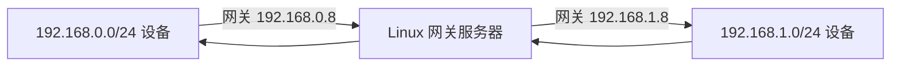

#  PPP PRIVATE NETWORK™ 2  
**企业级虚拟以太网 VPN 解决方案**  
下一代安全网络接入技术，提供高性能虚拟以太网隧道服务  

<div align="right" style="margin-top:-40px;">
  <kbd>
    <a href="README.md">English</a>
  </kbd>
  <kbd style="background:#0366d6;">
    <strong>简体中文</strong>
  </kbd>
</div>

##  核心技术特点

<div style="display: grid; grid-template-columns: repeat(2, 1fr); gap: 12px;">

<div>

-  **同步超线程IO技术**  
-  **全协程+多线程架构**  
-  **支持可打印明文传输**  
-  **全双工/半双工隧道**  
-  **VPN虚拟子网**  
-  **端口映射到公网 P-NAT2**  
-  **正向代理支持**  
-  **虚拟防火墙**  
-  **虚拟BGP多线分流**  
-  **域名查询分流**  
-  **天然支持软路由**  
-  **PaperAirplane 分层技术**  
</div>

<div>

-  **双网络协议栈支持**  
-  **广播支持（非单播）**  
-  **多种隧道协议支持**  
-  **MUX多路复用**  
-  **DNS缓存**  
-  **专用虚拟内存**  
-  **CDN转发支持**  
-  **VPN Turbo**  
-  **TCP Fast Open**  
-  **固定窗口大小设置**  
-  **VPN服务器代理转发**  
-  **UDP多线路宽频聚合**  

</div>

</div>

---

##  平台支持
-  Windows
-  Linux
-  macOS
-  Android

##  支持的CPU架构
- **x86系列**  
  i386 · x86_64
- **ARM系列**  
  armv7l · armv7a · aarch64
- **其他架构**  
  s390x · mipsel · ppc64el · riscv64

---

##  用户许可协议
### ✅ 授权使用群体
<details open>
<summary>点击查看授权用户类别</summary>

1. 🎓 学术研究人员  
2. 💻 软件工程师  
3. 🌐 网络工程师  
4. 🏢 企业用户  
5. 🔬 科研技术人员  
6. 📦 外贸用户  
7. 🏛️ 政企人员  
8. 🎮 游戏玩家  
9. 🏬 集团客户  
10. 🏣 公共组织  
11. ➰ 通信技术  
12. ☁️ IT及互联网  
13. 🔒 网络安全用户  
14. 📝 健康内容创作者  
15. 🌍 非中国大陆用户
</details>

> ⚠️ **使用限制警告**  
>  **其他用户使用均违反协议**  
>  违规使用将承担法律责任</img>

### ⚠️ 八类绝对禁止行为法律与技术详解  

#### 🚫 禁止行为分类与法律依据  
| 行为类型       | 具体场景                  | 法律依据                                                                 | 技术特征                     |  
|----------------|--------------------------|--------------------------------------------------------------------------|------------------------------|  
| **政治安全**   | 颠覆政权/煽动分裂        | 《刑法》第105条（颠覆国家政权罪）                                        | Tor暗网节点通信/加密政治频道 |  
| **色情犯罪**   | 儿童色情/跨境网络招嫖    | 《刑法》第364条（传播淫秽物品罪） + 美国FOSTA法案                        | 哈希值匹配/特定支付模式      |  
| **赌博运营**   | 虚拟货币赌场/赌资洗钱    | 《刑法》第303条（赌博罪） + 塞舌尔《赌博法》第45条                       | 高频小额转账/固定赔率接口    |  
| **毒品交易**   | 暗网毒品商城/制毒教程    | 《刑法》第347条（毒品罪） + 美国《管制物质法》§841                       | I2P网络流量/比特币混合器     |  
| **人口犯罪**   | 贩卖劳工/性剥削          | 《刑法》第240条（拐卖妇女儿童罪） + 联合国《巴勒莫议定书》               | 虚假招聘网站/跨国通讯群组    |  
| **金融犯罪**   | 虚拟货币跑分/四件套贩卖  | 《刑法》第191条（洗钱罪） + 美国《银行保密法》                           | 分散聚合交易/多级空壳钱包    |  
| **电信诈骗**   | 仿冒公检法/杀猪盘        | 《反电信诈骗法》第38条 + 美国FCC 47 CFR §64.1200                         | VOIP伪装/钓鱼页面指纹        |  
| **非法交易**   | KYC伪造/用户隐私倒卖     | 《个人信息保护法》第66条 + 欧盟GDPR第83条                                | 撞库行为/批量身份认证请求    |  

### ⚖️ 三国法律叠加追责机制（跨境司法执行框架）  

| **司法管辖区** | **执法主体**               | **核心法律武器**                          | **量刑标准**                                                                 | **跨国协作机制**                  |  
|----------------|----------------------------|------------------------------------------|-----------------------------------------------------------------------------|----------------------------------|  
| **中国大陆**   | 公安部网安局               | 《刑法》第191条（洗钱罪）                 | - 洗钱罪：**10年徒刑+涉案金额5倍罚金**<br>- 危害国家安全罪：**无期徒刑**         | 通过国际刑警组织红色通缉令引渡    |  
| **美国**       | FBI网络犯罪部              | 《计算机欺诈与滥用法》(CFAA 18 U.S.C. §1030) | - 金融犯罪：**20年监禁**<br>- 儿童色情犯罪：**最低25年监禁**（强制量刑）           | 依据CLOUD Act跨境调取云数据       |  
| **塞舌尔**     | FIU金融情报中心            | 《反洗钱法2020》第15条                    | - 非法赌博：**5年监禁+10万美金罚金**<br>- 数据犯罪：**每日1万美金累进罚款**      | 英联邦司法互助条约自动执行裁决    |  

#### 🌐 跨境追责技术取证流程（GitHub 兼容版）

##### ⏱️ 取证时序流程
| 步骤 | 发起方          | 接收方          | 行动内容                         | 法律依据                                   | 时限       |
|------|----------------|----------------|--------------------------------|------------------------------------------|-----------|
| 1    | 国安机关        | FBI            | 共享犯罪证据链                   | MLAT 司法互助协议                         | 72小时     |
| 2    | FBI            | 塞舌尔FIU       | 签发加密资产冻结令               | 《反洗钱法2020》第15条                     | 立即生效   |
| 3    | 塞舌尔FIU      | 云服务商        | 执行数据扣押令                   | 《塞舌尔刑事司法互助法》第8条               | 72小时生效 |
| 4    | 云服务商        | 开发者          | 请求司法协助（仅限元数据）       | 18 U.S.C. § 2703(f)（存储通信法案）         | 15工作日   |
| 5    | 开发者          | 国际刑警        | 提交 GitHub 提交日志             | GPL-3.0 第15-17条（无担保声明条款）         | 即时       |
| 6    | 国际刑警        | 三国法庭        | 提交区块链取证联合公诉书         | 《联合国反腐败公约》第46条                 | 30日历日   |

##### 🔗 关键证据移交节点
```diff
! 证据链1: 加密资产流向图
+ 提交至: 塞舌尔金融情报中心(FIU)
- 技术手段: Chainalysis 链上追踪
# 法律效力: 《反洗钱法2020》附件3

! 证据链2: GitHub 开发日志
+ 提交至: INTERPOL 数字犯罪科
- 技术验证: GPG 签名+时间戳
# 法律效力: 海牙电子证据公约
```

### ⚠️ 用户法律风险提示  

+ 中国用户：  
   - 依据《反电信诈骗法》第38条，涉案账户**三代亲属银行卡连带冻结**  
   - 危害国家安全行为适用《刑法》第113条，**最高可判处死刑**  
   - 非法跨境数据传输触发《数据安全法》第45条，**处以500万以下罚金+吊销执照**

+ 美国用户：  
   - FBI启动"无国界管辖权"（基于美元结算通道），**无需引渡直接起诉**  
   - 涉及儿童色情按《18 U.S.C. §2251》**强制最低刑期25年**  
   - 金融犯罪适用《RICO法案》，**可没收全部涉案资产**

+ 塞舌尔用户：  
   - 离岸公司实控人承担**个人无限责任**（Pierce Corporate Veil原则）  
   - 违反《反洗钱法2020》第7条者，**每日追加1万美金累进罚款**  
   - 涉暗网交易适用《ICT法案》第88条，**最低刑期10年不得假释**

### ⚠️ 违法后果现实案例参照  

#### 💼 虚拟货币洗钱类  
| **司法管辖区** | **案例详情**               | **处罚结果**                                  | **技术取证手段**                  |  
|----------------|--------------------------|---------------------------------------------|----------------------------------|  
| **中国大陆**   | 赵东案（OTC商家）          | 罚金**2300万元** + **7年有期徒刑**           | 链上追踪混币器资金流向              |  
| **美国**       | BitMEX交易所案            | CEO刑期**30个月** + 个人罚金**1000万美元**   | 分析Kraken交易所API日志            |  
| **塞舌尔**     | OneCoin（维卡币）传销案    | **查封35个离岸账户** + 全球通缉实控人         | SWIFT跨境支付记录分析              |  

#### 🎲 跨境赌博运营类  
| **司法管辖区** | **案例详情**               | **处罚结果**                                  | **技术取证手段**                  |  
|----------------|--------------------------|---------------------------------------------|----------------------------------|  
| **中国大陆**   | 亚博体育平台案             | 追缴**38亿元** + 主犯**无期徒刑**            | 支付宝特约商户流水穿透分析          |  
| **美国**       | Bovada赌博平台             | **没收1亿美元资产** + 域名永久关停            | Cloudflare日志匹配DDoS攻击模式     |  
| **塞舌尔**     | Bet365塞舌尔分公司         | **吊销赌博牌照** + 罚金**300万美元**         | 服务器租赁合同溯源                 |  

#### 📊 数据贩卖与隐私犯罪类  
| **司法管辖区** | **案例详情**               | **处罚结果**                                  | **技术取证手段**                  |  
|----------------|--------------------------|---------------------------------------------|----------------------------------|  
| **中国大陆**   | 考拉征信案               | CEO判刑**3年** + 公司罚金**5000万元**        | 数据库权限日志审计                |  
| **美国**       | Equifax数据泄露案        | **赔偿7亿美元** + 永久安全合规监管            | 漏洞利用流量包还原                |  
| **塞舌尔**     | Seychelles Data Hub案    | **强制清算** + 高管引渡至美国受审             | AWS S3存储桶访问日志分析          |  

#### ⚠️ 八类行为叠加处罚案例  
| **案件名称**   | **犯罪行为组合**                              | **三国叠加处罚结果**                                                                 |  
|----------------|---------------------------------------------|------------------------------------------------------------------------------------|  
| 银河国际案     | 赌博+洗钱+跨境支付                           | 中国：**主犯死刑缓期**<br>美国：**没收纽约房产**<br>塞舌尔：**注销378家壳公司**          |  
| DarkScandals案 | 儿童色情+比特币洗钱+VPN隐匿                  | 美国：**首犯175年监禁**<br>中国：**查封矿场**<br>塞舌尔：**冻结$120M加密资产**         |  

### 📜 开发者免责条款
/* 经三国司法实践验证的免责文本 */  
1. **技术中立原则**  
   本工具系网络协议纯技术实现（RFC 8446标准），开发者：  
   - 不运营任何服务器  
   - 不存储用户流量日志  
   - 不提供商业支持服务  

2. **违法责任隔离机制**  
   ```mermaid
   graph LR
      用户行为-->ISP[网络服务提供商]
      开发者-->代码[GitHub仓库]
      司法取证-->ISP
      开发者-.无权访问.->用户行为
   ```

### ⚖️ 司法配合限度声明  

#### 📜 开发者合规配合框架  
   ```mermaid
   graph LR
        A[执法请求] --> B{是否符合法定门槛}
        B -->|是| C[提供限定材料]
        B -->|否| D[书面拒绝并备案]
        C --> E[材料交付记录]
        D --> F[司法救济程序]
        classDef green fill:#d6f5d6,stroke:#28a745
        classDef red fill:#ffd6cc,stroke:#dc3545
        class C,E green
        class D,F red
   ```

### ⚖️ 三国司法配合细则  

| **司法辖区**   | **法定取证门槛**                          | **可提供材料**                          | **材料交付时限** | **拒绝依据**                     |  
|----------------|------------------------------------------|----------------------------------------|----------------|--------------------------------|  
| **中国大陆**   | 省级网安部门《调取证据通知书》<br>+《协助调查函》 | 1. GitHub提交历史元数据<br>2. 代码数字签名证书<br>3. 开源协议副本 | 15工作日       | 《网络安全法》第28条            |  
| **美国**       | FISA Court签发的Section 702指令<br>+ DoJ背书 | 1. PGP签名验证文件<br>2. CI/CD构建日志<br>3. 第三方审计报告 | 72小时         | 第四修正案+DMCA 512(f)         |  
| **塞舌尔**     | 最高法院司法互助令<br>+ FIU反洗钱协查令     | 1. GPL-3.0许可证公证文本<br>2. 贡献者CLA协议<br>3. 版权登记证书 | 30日历日       | 《电子交易法》第41条           |  

#### ⚠️ 绝对不配合情形  
- 无正式司法文书的口头/邮件请求
- 要求提供用户流量日志或通信内容
- 索取非公开的代码设计文档
- 跨境司法请求未经过海牙认证
+ 合规应对：立即启动《司法抗辩预案》第7章流程

### ⚔️ 司法配合预案  
+ **司法冻结响应**  
  收到取证请求后立即执行：  
  ```bash
  # 冻结GitHub仓库防止篡改
  gh api repos/liulilittle/openppp2/actions/permissions --method PUT -f enabled=false
  # 激活司法保护分支
  git checkout -b legal_lockdown
  git push origin --force legal_lockdown
  ```

### 🎣 反钓鱼验证流程 ###
```diff
+ Step1: 提取司法文书数字签名
+ Step2: 连接CNNIC/GlobalSign根证书链验证
- Step3: 若验证失败立即触发司法警报
! Step4: 向EFF发送违规取证报告
```

---

##  命令行接口
### ⚙️ 通用命令

| 命令 | 功能 | 格式 | 默认值 |
|------|------|------|:------:|
| `--rt` | 实时模式 | `--rt=[yes｜no]` | `yes` |
| `--dns` | 设置DNS服务器 | `--dns <IP列表>` | `8.8.8.8,8.8.4.4` |
| `--tun-flash` | 启用高级QoS策略控制 | `--tun-flash=[yes｜no]` | `no` |
| `--pull-iplist` | 下载国家IP列表 | `--pull-iplist [文件]/[国家]` | `./ip.txt/CN` |
| `--config` | 配置文件路径 | `--config <文件路径>` | `./appsettings.json` |
| `--mode` | 运行模式 | `--mode=[client｜server]` | `server` |

> 🔗 **IP列表数据源**: [APNIC 官方列表](http://ftp.apnic.net/apnic/stats/apnic/delegated-apnic-latest)

---

### 🖥️ 服务器命令

| 命令 | 功能 | 格式 | 默认值 |
|------|------|------|:------:|
| `--firewall-rules` | 防火墙规则文件 | `--firewall-rules <文件>` | `./firewall-rules.txt` |

---

### 💻 客户端命令

#### 核心设置
| 命令 | 功能 | 格式 | 默认值 |
|------|------|------|:------:|
| `--lwip` | [协议栈选择](#network-protocol-static-guide) | `--lwip=[yes｜no]` | Win: `yes`<br>其他: `no` |
| `--vbgp` | 智能路由分流 | `--vbgp=[yes｜no]` | `yes` |
| `--nic` | 指定物理网卡 | `--nic <网卡名>` | 自动选择 |
| `--ngw` | 强制网关地址 | `--ngw <IP>` | 自动获取 |

#### 虚拟网卡
| 命令 | 功能 | 格式 | 默认值 |
|------|------|------|:------:|
| `--tun` | 网卡名称 | `--tun <名称>` | [平台相关](#network-card-name-default-guide) |
| `--tun-ip` | IP地址 | `--tun-ip <IP>` | `10.0.0.2` |
| `--tun-gw` | 网关地址 | `--tun-gw <IP>` | [平台相关](#network-card-gateway-address-default-guide) |
| `--tun-mask` | 子网掩码 | `--tun-mask <位数>` | `30` |
| `--tun-host` | 首选网络 | `--tun-host=[yes｜no]` | `yes` |

#### 高级功能
| 命令 | 功能 | 格式 | 默认值 |
|------|------|------|:------:|
| `--tun-mux` | MUX连接数 | `--tun-mux <`[连接数](#mux-connection-number-guide)`>` | `0` |
| `--tun-mux-acceleration` | MUX加速 | `--tun-mux-acceleration <`[模式](#mux-acceleration-mode-guide)`>` | `0` |
| `--tun-vnet` | 子网转发 | `--tun-vnet=[yes｜no]` | `yes` |
| `--tun-ssmt` | 超线程优化 | `--tun-ssmt=[`[线程数](#ssmt-threading-number-guide)`]/[`[模式](#ssmt-threading-optimize-mode-guide)`]` | `4/st` |
| `--tun-static` | [静态隧道](#udp-static-aggligator) | `--tun-static=[yes｜no]` | `no` |
| `--link-restart` | 链路重连次数 | `--link-restart=[重连次数]` | `0` |
| `--block-quic` | 阻止QUIC流量 | `--block-quic=[yes\|no]` | `no` |
| `--auto-restart` | 自动重启程序 | `--auto-restart=[秒]` | `0` |

#### 路由设置
| 命令 | 功能 | 格式 | 默认值 |
|------|------|------|:------:|
| `--bypass` | 绕过列表 | `--bypass <文件>` | `./ip.txt` |
| `--bypass-nic` | 指定绕过列表的接口 | `--bypass-nic <网卡>` | |
| `--bypass-ngw` | 指定绕过列表的网关 | `--bypass-ngw <IP>` | `0.0.0.0` |
| `--virr` | 自动更新并生效 | `--virr [文件]/[国家]` | `./ip.txt/CN` |
| `--dns-rules` | DNS规则 | `--dns-rules <文件>` | [./dns-rules.txt](#dns-rules-guide) |

#### 平台专用
| 命令 | 平台 | 功能 | 格式 | 默认值 |
|------|:----:|------|------|:------:|
| `--tun-route` |  | 路由兼容 | `--tun-route=[yes｜no]` | `no` |
| `--tun-protect` |  | 路由保护 | `--tun-protect=[yes｜no]` | `yes` |
| `--tun-promisc` |   | 混杂模式 | `--tun-promisc=[yes｜no]` | `yes` |

---

### 🪟 Windows 命令

| 命令 | 功能 | 格式 |
|------|------|------|
| `--system-network-reset` | 网络重置 | `--system-network-reset` |
| `--system-network-optimization` | 性能优化 | `--system-network-optimization` |
| `--system-network-preferred-ipv4` | 设置IPV4网络优先 | `--system-network-preferred-ipv4` |
| `--system-network-preferred-ipv6` | 设置IPV6网络优先 | `--system-network-preferred-ipv6` |
| `--no-lsp` | 禁用LSP | `--no-lsp` |

---

## 📚 全局参数

<a id="mux-acceleration-mode-guide"></a>

###  MUX 加速模式
| 值 | 模式 | 适用场景 |
|:--:|------|----------|
| 0 | 标准 | 常规使用 |
| 1 | 服务器加速 | 下载密集型 |
| 2 | 客户端加速 | 上传密集型 |
| 3 | 双向加速 | 高性能需求 |

<a id="network-card-name-default-guide"></a>

###  虚拟网卡默认值
| 平台 | 默认值 |
|------|--------|
| Windows | `PPP` |
| Linux | `ppp` |
| macOS | `utun0` |

<a id="network-card-gateway-address-default-guide"></a>

###  虚拟网关服务器默认值

| 平台    | 默认值        | 规则             |
|---------|--------------|------------------|
| Windows | `10.0.0.0`   | (IP & MASK)      |
| Linux   | `10.0.0.1`   | (IP & MASK) + 1  |
| macOS   | `10.0.0.1`   | (IP & MASK) + 1  |

<a id="ssmt-threading-optimize-mode-guide"></a>

###  SSMT 优化模式
| 模式 | 优化方向 |
|------|----------|
| st | 单连接大流量 |
| mq | 多连接高并发 |

<a id="symbol-explanation-guide"></a>

### 💾 符号说明
| 符号 | 说明 |
|:----:|------|
| `[ ]` | 可选参数 |
| `< >` | 必填参数 |
| `｜` | 选项分隔 |
| `!` | 不可用或禁用 |

<a id="network-protocol-static-guide"></a>

### 🌐 网络协议栈
| 类型 | 说明 |
|:--------:|---------|
| `lwip` | 适用于 `Windows` |
| `ctcp` | 适用于 [!](#symbol-explanation-guide)`Windows` |

##  编译指南

必须使用支持 C++17 的编译器，其余无特殊要求。按标准方式安装 C++17 开发环境即可。

### 依赖要求
#### 最小依赖  
- **Boost** >= 1.70 and <= 1.8.6
- **jemalloc** >= 5.30 (Android除外)  
- **OpenSSL** >= 1.1.x  

#### 完整依赖
- Boost  
- jemalloc  
- OpenSSL  
- cURL  

#### 资源地址  
- **cURL:** https://github.com/curl/curl
- **jemalloc:** https://github.com/jemalloc/jemalloc
- **openssl:** https://github.com/openssl/openssl
- **Boost:** https://www.boost.org/releases/latest

### 平台编译指南
| 平台 | 工具链 | 推荐方式 | 注意事项 |
|------|--------|----------|----------|
| **Windows** | Visual Studio 2022 | [vcpkg](https://github.com/microsoft/vcpkg) | 使用静态编译 (`/MT`, `/MTd`) |
| **Linux** | GCC/Clang | 手动编译 | [参考脚本](https://github.com/liulilittle/openppp2/blob/main/.github/workflows/build-openppp2-for-linux-using-ubuntu-latest.yml) |
| **macOS** | LLVM-Clang | 手动编译 | [参考脚本](https://github.com/liulilittle/openppp2/blob/main/.github/workflows/build-openppp2-for-darwin-using-macos-latest.yml) |
| **Android** | NDK r20b | 交叉编译 | [参考脚本](https://github.com/liulilittle/openppp2/blob/main/.github/workflows/build-openppp2-for-android-using-ubuntu-latest-cross.yml) |

### 预编译库资源
- **Linux**: [openppp2-ubuntu-3rd-environment](https://github.com/liulilittle/openppp2-ubuntu-3rd-environment)  
- **macOS**: [openppp2-macos-amd64-environment](https://github.com/liulilittle/openppp2-macos-amd64-environment)  
- **Android**: [openppp2-android-ndk-r20b-3rd-environment](https://github.com/liulilittle/openppp2-android-ndk-r20b-3rd-environment)  

### 环境要求
必须使用支持 C++17 的编译器，其余无特殊要求。按标准方式安装 C++17 开发环境即可。

---

### 编译命令
1. **设置三方库路径**  
   修改 `CMakeLists.txt` 中的依赖库目录：  
   `SET(THIRD_PARTY_LIBRARY_DIR /your/actual/path)`

2. **编译与执行**  
    ```bash
    # Linux/macOS 编译流程
    mkdir build && cd build
    cmake .. -DCMAKE_BUILD_TYPE=Release
    make -j$(nproc)  # Linux自动检测核心数
    cd ../bin && ./ppp  # 运行程序
    ```

### 预编译宏
ANCIL_FD_BUFFER_STRUCT  
启用 sendfd/recvfd 共享文件描述符的父进程fd保护模式

CURLINC_CURL  
通过 cURL 库访问 HTTP/HTTPS 资源

TRANSMISSION_O1  
强制网络传输层使用 /O1 编译优化

JEMALLOC  
使用 jemalloc 内存分配器替代默认分配器

BUDDY_ALLOC_IMPLEMENTATION  
使用 buddy allocator 管理虚拟内存分配

__MUSL__  
静态链接 musl-libc C++ 标准库（脱离 GNU/LIBC）

_LARGEFILE64_SOURCE  
确保 musl-libc 支持 64 位文件操作函数

### IO_URING 版本编译
1. 从 [liburing](https://github.com/axboe/liburing) 下载源码并编译安装
2. 取消 `CMakeLists.txt` 中以下代码的注释：
   ```cmake
   # IF(PLATFORM_SYSTEM_LINUX) 
   #     ADD_DEFINITIONS(-DBOOST_ASIO_HAS_IO_URING=1)
   #     ADD_DEFINITIONS(-DBOOST_ASIO_DISABLE_EPOLL=1)
   # ENDIF()
3. 取消 TARGET_LINK_LIBRARIES 中 # liburing.a 的注释
    ```cmake
    TARGET_LINK_LIBRARIES(${NAME} 
        libc.a
        libssl.a 
        libcrypto.a 
        libjemalloc.a
        # liburing.a

        atomic
        dl
        pthread

        libboost_system.a
        libboost_coroutine.a 
        libboost_thread.a 
        libboost_context.a 
        libboost_regex.a
        libboost_filesystem.a) 
    ```
4. 按标准 Linux 流程编译

## 🚀 SIMD + AES_NI 优化实现
### 优化算法
| 算法名称               | 实现文件路径                                                                                     |
|------------------------|--------------------------------------------------------------------------------------------------|
| `simd-aes-128-cfb`     | [simd_aes_128_cfb.cpp](https://github.com/liulilittle/openppp2/blob/main/common/aesni/impl/simd_aes_128_cfb.cpp) |
| `simd-aes-256-cfb`     | [simd_aes_256_cfb.cpp](https://github.com/liulilittle/openppp2/blob/main/common/aesni/impl/simd_aes_256_cfb.cpp) |
| `simd-aes-128-gcm`     | [simd_aes_128_gcm.cpp](https://github.com/liulilittle/openppp2/blob/main/common/aesni/impl/simd_aes_128_gcm.cpp) |
| `simd-aes-256-gcm`     | [simd_aes_256_gcm.cpp](https://github.com/liulilittle/openppp2/blob/main/common/aesni/impl/simd_aes_256_gcm.cpp) |

**前提条件**  
1. 仅支持 i386/amd64 处理器平台  
2. CPU 必须支持 AES-NI 指令集  
   （PPP 将通过汇编指令自动检测 CPU 支持性）

**编译步骤**  
1. 修改 `CMakeLists.txt` 文件：
   ```cmake
   SET(__SIMD__ TRUE)  # 原值为 FALSE
2. 按标准 Linux 流程编译：
    ```bash
    mkdir build && cd build
    cmake .. -DCMAKE_BUILD_TYPE=Release
    make -j $(nproc) 
    ```

**注意事项**  
- 仅支持 i386/amd64 平台，其他平台启用将导致编译失败  
- 需 CPU 硬件支持 AES-NI 指令集（PPP 自动检测）  
- 仅优化以下算法：  
  - `simd-aes-128-cfb`  
  - `simd-aes-256-cfb`  
  - `simd-aes-128-gcm`  
  - `simd-aes-256-gcm`  
- 修改 `CMakeLists.txt` 后需完整重编译：
  ```bash
  rm -rf build && mkdir build && cd build
  cmake .. -DCMAKE_BUILD_TYPE=Release
  make clean && make -j $(nproc)
  ```

---

## 🌐 配置文件
### 🌍 全局配置

| 参数名      | 类型   | 默认值        | 说明                                   | 适用             |
|-------------|--------|--------------|--------------------------------------|------------------|
| concurrent  | int    | 1            | [并发线程数](#concurrent-number-guide) | `client｜server` |
| cdn         | array  | [80, 443]    | 使用的CDN端口列表                   | `server`         |

### 🔑 加密设置 (key)
| 参数名          | 类型    | 值示例             | 说明                          | 一致性 | 适用             |
|-----------------|---------|-------------------|------------------------------|--------|------------------|
| kf              | int     | 154543927         | 密钥生成因子                 | 强制   | `client｜server`|
| kx              | int     | 128               | 插花因子                     | 非强制 | `client｜server`|
| kl              | int     | 10                | NOP最小位                    | 非强制 | `client｜server`|
| kh              | int     | 12                | NOP最大位                    | 非强制 | `client｜server`|
| sb              | int     | 1000              | 动态滑板大小(字节)           | 非强制 | `client｜server`|
| protocol        | string  | aes-128-cfb       | 协议层加密算法               | 强制   | `client｜server`|
| protocol-key    | string  | N6HMzdUs7IUnYHwq  | 协议层加密密钥               | 强制   | `client｜server`|
| transport       | string  | aes-256-cfb       | 传输层加密算法               | 强制   | `client｜server`|
| transport-key   | string  | HWFweXu2g5RVMEpy  | 传输层加密密钥               | 强制   | `client｜server`|
| masked          | bool    | false             | 是否启用流量混淆             | 强制   | `client｜server`|
| plaintext       | bool    | false             | 是否允许明文传输             | 强制   | `client｜server`|
| delta-encode    | bool    | false             | 是否启用增量编码             | 强制   | `client｜server`|
| shuffle-data    | bool    | false             | 是否启用数据随机化           | 强制   | `client｜server`|

### 📡 网络接口 (ip)
| 参数名      | 类型   | 值示例        | 说明                     | 适用             |
|-------------|--------|--------------|------------------------|------------------|
| public      | string | 192.168.0.24 | 公网IP地址              | `server`         |
| interface   | string | 192.168.0.24 | 本地监听接口IP          | `server`         |

### 💾 虚拟内存 (vmem)
| 参数名 | 类型   | 值示例   | 说明                     | 适用             | 平台             |
|--------|--------|----------|------------------------|------------------|------------------|
| size   | int    | 4096     | 内存池大小(MB)          | `client｜server` | `all`            |
| path   | string | "./{}"   | 内存文件存储路径         | `client｜server` | [!](#symbol-explanation-guide)`windows`       |

### 🔌 TCP配置
| 参数名               | 类型   | 值示例 | 说明                          | 适用             |
|----------------------|--------|--------|------------------------------|------------------|
| inactive.timeout     | int    | 300    | 连接空闲超时时间(秒)          | `client｜server` |
| connect.timeout      | int    | 5      | 连接建立超时时间(秒)          | `client｜server` |
| connect.nexcept      | int    | 4      | ​连接建立超时时间的随机扩展范围(秒)​​ | `client｜server` |
| listen.port          | int    | 20000  | 监听端口                     | `client｜server` |
| cwnd                 | int    | 0      | 拥塞窗口大小(自动调整)        | `client｜server` |
| rwnd                 | int    | 0      | 接收窗口大小(自动调整)        | `client｜server` |
| turbo                | bool   | true   | 启用TCP加速                 | `client｜server` |
| backlog              | int    | 511    | 最大挂起连接数               | `client｜server` |
| fast-open            | bool   | true   | 启用TCP Fast Open          | `client｜server` |

### 📶 UDP配置
| 参数名                      | 类型   | 值示例                     | 说明                          | 适用             |
|-----------------------------|--------|----------------------------|-----------------------------|------------------|
| cwnd                        | int    | 0                          | 拥塞窗口大小                 | `client｜server` |
| rwnd                        | int    | 0                          | 接收窗口大小                 | `client｜server` |
| inactive.timeout            | int    | 72                         | 连接空闲超时(秒)             | `client｜server` |
| dns.timeout                 | int    | 4                          | DNS查询超时(秒)              | `client｜server` |
| dns.ttl                     | int    | 60                         | DNS缓存TTL(秒)               | `client｜server` |
| dns.cache                   | bool   | true                       | 启用DNS缓存                 | `client｜server` |
| dns.turbo                   | bool   | false                      | 启用Turbo模式               | `client｜server` |
| dns.redirect                | string | "0.0.0.0"                  | DNS重定向地址                | `server`         |
| listen.port                 | int    | 20000                      | 监听端口                     | `server`         |
| static.keep-alived          | array  | [1,5]                      | 保活间隔[最小值,最大值](秒)  | `client`         |
| static.dns                  | bool   | true                       | 启用静态DNS服务             | `client`         |
| static.quic                 | bool   | true                       | 启用QUIC支持                | `client`         |
| static.icmp                 | bool   | true                       | 启用ICMP支持                | `client`         |
| static.[aggligator](#udp-static-aggligator)           | int    | 4                          | 宽频聚合器链接数             | `client`         |
| static.servers              | array  | ["1.0.0.1:20000", ...]     | 静态服务器地址列表           | `client`         |

### 🔄 多路复用 (mux)
| 参数名               | 类型   | 值示例 | 说明                          | 适用             |
|----------------------|--------|--------|-----------------------------|------------------|
| connect.timeout      | int    | 20     | 连接建立超时(秒)             | `client｜server` |
| inactive.timeout     | int    | 60     | 流空闲超时(秒)               | `client｜server` |
| congestions          | int    | 134217728 | 最大拥塞控制窗口(字节)      | `client｜server` |
| keep-alived          | array  | [1,20] | 保活间隔[最小值,最大值](秒)  | `client｜server` |

### 🌐 WebSocket配置
| 参数名                          | 类型   | 值示例                                   | 说明                          | 适用             |
|---------------------------------|--------|------------------------------------------|------------------------------|------------------|
| host                            | string | starrylink.net                           | 服务器域名                   | `server`         |
| path                            | string | /tun                                     | WebSocket路径                | `server`         |
| listen.ws                       | int    | 20080                                    | HTTP监听端口                 | `server`         |
| listen.wss                      | int    | 20443                                    | HTTPS监听端口                | `server`         |
| ssl.certificate-file            | string | starrylink.net.pem                       | SSL证书文件                   | `server`         |
| ssl.certificate-chain-file      | string | starrylink.net.pem                       | SSL证书链文件                 | `server`         |
| ssl.certificate-key-file        | string | starrylink.net.key                       | SSL私钥文件                   | `server`         |
| ssl.certificate-key-password    | string | test                                     | SSL私钥密码                   | `server`         |
| ssl.ciphersuites                | string | TLS_AES_256_GCM_SHA384:...               | 加密套件列表                   | `client｜server` |
| verify-peer                     | bool   | true                                     | 根证书验证                     | `client`         |
| http.error                      | string | Status Code: 404; Not Found              | HTTP错误响应内容               | `server`         |
| http.request                    | object | {Cache-Control: "no-cache", ...}        | 自定义HTTP请求头               | `client`         |
| http.response                   | object | {Server: "Kestrel"}                     | 自定义HTTP响应头               | `server`         |

### 🖥️ 服务器配置 (server)
| 参数名       | 类型   | 值示例                               | 说明                          | 适用             |
|--------------|--------|--------------------------------------|------------------------------|------------------|
| log          | string | ./ppp.log                            | 日志文件路径                  | `server`         |
| node         | int    | 1                                    | 服务器节点ID                  | `server`         |
| subnet       | bool   | true                                 | 启用子网分配                  | `server`         |
| mapping      | bool   | true                                 | 启用端口映射                  | `server`         |
| backend      | string | ws://192.168.0.24/ppp/webhook        | 管理后台URL                   | `server`         |
| backend-key  | string | HaEkTB55VcHovKtUPHmU9zn0NjFmC6tff   | 管理后台认证密钥              | `server`         |

### 💻 客户端配置 (client)
| 参数名                     | 类型   | 值示例                                   | 说明                          | 适用             |
|----------------------------|--------|------------------------------------------|------------------------------|------------------|
| guid                       | string | {F4569208-BB45-4DEB-B115-0FEA1D91B85B}   | 客户端唯一标识符             | `client`         |
| server                     | string | ppp://192.168.0.24:20000/                | 服务器连接地址               | `client`         |
| server-proxy               | string | [http\|socks]://user:pass@192.168.0.18:8080/      | 连接服务器的代理地址         | `client`         |
| bandwidth                  | int    | 10000                                    | 带宽限制(Kbp/s)               | `client`         |
| reconnections.timeout      | int    | 5                                        | 重连等待时间(秒)             | `client`         |
| paper-airplane.tcp         | bool   | true                                     | 启用纸飞机TCP加速            | `client`         |
| http-proxy.bind            | string | 192.168.0.24                             | HTTP代理绑定地址             | `client`         |
| http-proxy.port            | int    | 8080                                     | HTTP代理端口                 | `client`         |
| socks-proxy.bind           | string | 192.168.0.24                             | SOCKS代理绑定地址            | `client`         |
| socks-proxy.port           | int    | 1080                                     | SOCKS代理端口                | `client`         |
| socks-proxy.username       | string | test                                     | SOCKS认证用户名               | `client`         |
| socks-proxy.password       | string | 123456                                   | SOCKS认证密码                 | `client`         |

#### 📍 端口映射 (mappings)
| 参数名       | 类型   | 值示例         | 说明                          | 适用      |
|--------------|--------|----------------|------------------------------|-----------|
| local-ip     | string | 192.168.0.24   | 本地IP地址                   | `client`  |
| local-port   | int    | 80             | 本地端口                     | `client`  |
| protocol     | string | tcp            | 协议类型(tcp/udp)            | `client`  |
| remote-ip    | string | ::             | 远程IP(::表示任意)           | `client`  |
| remote-port  | int    | 10001          | 远程端口                     | `client`  |

#### 🛣️ 路由规则 (routes)
| 参数名 | 类型   | 值示例                     | 说明                     | 适用      |
|--------|--------|----------------------------|------------------------|-----------|
| name   | string | CMNET                     | 路由规则名称           | `client`  |
| nic    | string | eth1                      | 网络接口名称           | `client`  |
| ngw    | string | 192.168.1.1               | 网关地址               | `client`  |
| path   | string | ./cmcc_cidr.txt           | 本地CIDR文件路径       | `client`  |
| vbgp   | string | `https://ispip.clang.cn/cmcc_cidr.txt` | 在线CIDR数据源URL | `client`  |

---

## 💡 配置指南 ##
<a id="mux-connection-number-guide"></a>

###  MUX 连接数
| 连接数 | 侧重方向 |
|------|----------|
| 4 | 低延迟 |
| 8 | 中延迟 |
| 12 | 高延迟 |
| 16 | 极高延迟 |

<a id="concurrent-number-guide"></a>

###  VPN 线程数
| 线程数   | 侧重方向 |
|----------|----------|
| 1        | 单核优化 |
| CPU核心数 + 1 | 多核优化 |

<a id="ssmt-threading-number-guide"></a>

###  SSMT 线程数  
| 线程数        | 侧重方向               | 推荐场景                  |
|---------------|------------------------|---------------------------|
| 1             | 单核性能优化 | 单任务处理/低负载环境      |
| CPU物理核心数 | 多核资源优化 | 高并发/多任务处理场景      |

---

<a id="dns-rules-guide"></a>

###  DNS 规则列表  
▶️ **中国大陆域名直连规则**（定期更新）：  
[github.com/liulilittle/dns-rules.txt](https://github.com/liulilittle/dns-rules.txt)  
`作用：绕过VPN进行DNS查询，加速本地域名解析`

---

###  HTTPS 证书配置  
**将根证书放入 VPN 运行目录：** `cacert.pem`  

| 来源     | 下载链接 |
|----------|----------|
| 镜像仓库 | [github.com/liulilittle/cacert.pem](https://github.com/liulilittle/cacert.pem) |
| CURL官方 | [curl.se/docs/caextract.html](https://curl.se/docs/caextract.html) |

> 🔒 证书作用：确保 HTTPS 访问安全验证

---

## 🚀 快速开始
### 服务器部署

#### 1. Ubuntu 18.04 LTS x86_64 快速启动
```bash
sudo su
screen -S openppp2
mkdir -p openppp2 && cd openppp2
wget https://github.com/liulilittle/openppp2/releases/latest/download/openppp2-linux-amd64-simd.zip
unzip openppp2-linux-amd64-simd.zip  
chmod a+x ppp
rm -rf *.txt *.key *.pem *.zip
```

##### 1.1. 配置后端
编辑配置文件 `appsettings.json`，删除或清空 `server.backend` 字段：
```json
"server": {
    "backend": "",  // 确保此值为空
    // 其他配置保持不变...
    "backend-key": "HaEkTB55VcHovKtUPHmU9zn0NjFmC6tff"
}
```

##### 1.1. 启动服务
```bash
./ppp
```

### 💻 客户端部署
#### 1. Windows 快速启动

**1.1 创建目录**  
以管理员身份运行 Powershell

**1.2 创建目录**  
```powershell
mkdir C:\openppp2
```

**1.3 下载并清理**  
1. 下载软件包至 `C:\openppp2`：  
   [openppp2-windows-amd64.zip](https://github.com/liulilittle/openppp2/releases/download/1.0.0.25226/openppp2-windows-amd64.zip)  
2. 解压后删除冗余文件：  
   ```powershell
   cd C:\openppp2
   rm cmcc_cidr.txt, crtc_cidr.txt, firewall-rules.txt, ip.txt, starrylink.net.key, starrylink.net.pem, openppp2-windows-amd64.zip
   ```

**1.4 客户端配置**  
编辑配置文件 `appsettings.json` 的以下部分：
```json
"client": {
    "guid": "{新生成的GUID}",                // 每个客户端唯一，不可重复
    "server": "ppp://192.168.0.24:20000/",  // 连接服务器地址和协议
    "server-proxy": "",                     // 留空（不使用代理）
    "bandwidth": 0                          // 0表示不限速
},
"static": {
    "keep-alived": [              // 保活设置（默认）
        1,
        5
    ],
    "dns": true,                  // 允许DNS
    "quic": true,                 // 允许QUIC
    "icmp": true,                 // 允许ICMP
    "aggligator": 0,              // 宽频聚合器链接数（0=禁用）
    "servers": [                  // 清空转发服务器列表

    ]
}
```

**1.5 启动客户端**  
   ```powershell
    # 以管理员身份运行：
    .\ppp --mode=client
   ```

### 🔗 连接协议列表
| 协议前缀 | 传输方式              | 适用场景                     |
|----------|-----------------------|------------------------------|
| `ppp://` | 原生 TCP 直连         | 低延迟、高吞吐量直接连接      |
| `ws://`  | WebSocket 明文传输    | CDN Forwarding       |
| `wss://` | SSL 加密 WebSocket    | CDN Forwarding       |

### 协议使用示例
```json
"server": "ppp://vpn.example.com:20000"   // TCP直连
"server": "ws://vpn.example.com:80"       // WebSocket
"server": "wss://vpn.example.com:443"     // 加密WebSocket
```

### ⚠️ 注意事项

#### 1. 首次运行
- 必须完成所有配置修改后再启动客户端  
- 修改配置后需重启客户端生效  

#### 2. GUID 生成
| 生成方式          | 命令/方法                          |
|-------------------|-----------------------------------|
| PowerShell        | `[guid]::NewGuid()`               |
| 在线生成器        | [guidgen.com](https://www.guidgen.com) |
| CMD               | `powershell -Command "[guid]::NewGuid()"` |

#### 3. 带宽设置
- 单位：**Kbp/s**  
- `0` = 无限制  
- 示例：`1024` = 128KB/s (≈1.0Mbps)  

#### 4. 网络要求
| 协议     | 需开放端口 | 防火墙要求          |
|----------|------------|---------------------|
| `ppp://` | TCP 20000  | 允许入站/出站连接   |
| `ws://`  | HTTP 80    | 允许HTTP流量        |
| `wss://` | HTTPS 443  | 允许SSL加密流量     |

### 🔧 故障排查
1. **连接失败**  
   - 检查服务器IP/端口是否正确  
   - 验证防火墙是否放行对应协议端口  

2. **GUID冲突**  
   - 不同设备必须使用不同GUID  
   - 复制客户端时需重新生成GUID  

3. **性能问题**  
   - CDN加速 `ws://` 协议（不推荐）
   - 优先使用 `ppp://` 协议（性能最佳）  

## 附录1

<a id="udp-static-aggligator"></a>

### UDP 宽频聚合器设置

`udp.static.aggligator` 值决定工作模式：
- **> 0**：启用聚合器，必须配置 `servers`（Aggligator 服务器列表）
- **≤ 0**：启用静态隧道，`servers` 为 `可选` 转发服务器列表

```json
"udp": {
    "static": {
        // ...其他配置
        "aggligator": 2,           // 工作模式选择（>0启用聚合器）
        "servers": [               // 服务器地址列表
            "192.168.1.100:6000", 
            "10.0.0.2:6000"
        ]
    }
}
```

### Aggligator 服务器要求
1. **独立部署**：
   - 需单独安装 [Aggligator](https://github.com/liulilittle/aggligator)  服务端

2. **节点配置**：
    ```bash
    ./aggligator --mode=server --flash=yes --congestions=1024 --bind=10000,10001 --host=192.168.0.24:7000
    ```

#### 参数说明表
| 参数 | 值 | 含义 | 详细说明 |
|------|----|------|----------|
| `--mode` | `server` | 运行模式 | 作为服务器端运行，接收并转发数据 |
| `--flash` | `yes` | QoS 策略控制 | 启用高级QoS策略控制 |
| `--congestions` | `1024` | 窗口大小 | 最大拥塞1024个UDP数据包<br>- 内存占用 ≈ 1024 × MTU(1500字节) ≈ 1.5MB<br>- 建议值：每核心512-2048 |
| `--bind` | `10000,10001` | 监听端口 | 本地监听端口列表（逗号分隔）<br>- 接收这些端口的数据<br>- 支持多端口负载均衡 |
| `--host` | `192.168.0.24:7000` | 转发目标 | 数据最终转发目标<br>- 必须是UDP服务<br>- 格式：`IP:端口`或`域名:端口` |

---

## 附录2

<a id="linux-route-forwarding"></a>

### 1. Linux 开启路由转发

1. 编辑 `/etc/sysctl.conf` 文件，并添加以下修改：
    ```conf
    net.ipv4.ip_forward = 1
    net.ipv4.conf.all.forwarding = 1
    net.ipv4.conf.default.forwarding = 1
    net.ipv6.conf.all.forwarding = 1
    net.ipv6.conf.default.forwarding = 1
    net.ipv6.conf.lo.forwarding = 1
    ```

2. 执行 `sysctl -p` 生效

### 2. Linux 设置 IPv4 网络优先

1. 编辑配置文件 `/etc/gai.conf`
2. 添加以下配置项：
    ```conf
    precedence ::ffff:0:0/96 100
    ```

    > **说明**：  
    > 此配置使系统优先选择 IPv4 地址进行网络连接

### 3. Linux 双网卡路由转发

#### 先决条件
确保已完成 [Linux 开启路由转发](#linux-route-forwarding) 的配置

#### 场景示例
实现 `192.168.1.0/24` 与 `192.168.0.0/24` 网段互通：

</img>



#### 路由配置命令
```bash
# 配置双向路由转发
iptables -t nat -A POSTROUTING -s 192.168.1.0/24 -j MASQUERADE
iptables -t nat -A POSTROUTING -s 192.168.0.0/24 -j MASQUERADE
```

#### 关键注意事项
##### ✅ 正确配置方式
必须为每个子网单独配置路由规则：
```bash
iptables -t nat -A POSTROUTING -s 192.168.1.0/24 -j MASQUERADE
iptables -t nat -A POSTROUTING -s 192.168.0.0/24 -j MASQUERADE
```

##### ❌ 禁止使用的配置
```bash
# 错误：使用合并网段会导致路由混乱
iptables -t nat -A POSTROUTING -s 192.168.0.0/23 -j MASQUERADE
```

**原因说明**：  
- 合并网段（/23）会使内核无法正确识别物理网卡出口
- 导致源地址转换混乱，网络连接失败
- 可能造成整个网络中断

#### 客户端网关配置
各子网设备需设置对应网关地址：
| 子网段          | 网关地址      |
|-----------------|--------------|
| 192.168.0.0/24  | 192.168.0.8  |
| 192.168.1.0/24  | 192.168.1.8  |

#### 验证效果
完成配置后：
- 192.168.0.0/24 网段设备可访问 192.168.1.0/24 网段
- 192.168.1.0/24 网段设备可访问 192.168.0.0/24 网段
- 双向通信延迟低，数据传输稳定

## 🌐 4. Linux 局域网旁路由 S-NAT 配置

### 📡 网络拓扑结构


### ⚙️ 设备配置
| 设备类型       | IP 地址        | 子网掩码         | 网关          |
|----------------|---------------|------------------|--------------|
| **主路由**     | 192.168.0.1   | 255.255.255.0    | -            |
| **旁路由**     | 192.168.0.20  | 255.255.255.0    | 192.168.0.1  |

### 🛠️ 配置步骤

1. **🌐 启用 IPv4 转发**  
   临时生效方案（重启后失效）：
   ```bash
   # 方法一
   echo 1 > /proc/sys/net/ipv4/ip_forward
   
   # 方法二（推荐）
   sudo sysctl -w net.ipv4.ip_forward=1
   
   # 验证生效
   sudo sysctl -p
   ```

2. **🔧 配置 iptables 规则**  
   ```bash
   # 允许子网出站流量
   sudo iptables -A FORWARD -s 192.168.0.0/24 -d 0.0.0.0/0 -j ACCEPT
   
   # 允许已建立连接的回包
   sudo iptables -A FORWARD -s 0.0.0.0/0 -d 192.168.0.0/24 -m state --state RELATED,ESTABLISHED -j ACCEPT
   
   # 允许ICMP重定向（可选）
   sudo iptables -A INPUT -p icmp --icmp-type 30 -j ACCEPT
   sudo iptables -A OUTPUT -p icmp --icmp-type 30 -j ACCEPT
   
   # 配置SNAT源地址转换
   sudo iptables -t nat -A POSTROUTING -s 192.168.0.0/24 -j SNAT --to 192.168.0.20
   ```

3. **🔍 客户端测试配置**
   ```bash
   将客户端网关改为旁路由IP：192.168.0.20
   执行连通性测试：
   ping 8.8.8.8
   traceroute google.com
   ```

### ⚠️ 常见问题 (FAQ)
> ❗ **正确配置但无法上网？**
> ```bash
> # 检查Docker服务是否干扰
> sudo systemctl status docker
>
> # 若存在Docker，临时停止服务测试
> sudo systemctl stop docker
>
> # 确认问题后，建议卸载或配置Docker网络
> sudo apt purge docker.io
> ```

### 📝 配置要点说明
| 关键配置项       | 作用说明                          | 推荐状态 |
|------------------|----------------------------------|----------|
| IP转发(net.ipv4.ip_forward) | 启用内核级数据包转发           | `=1`     |
| FORWARD规则      | 控制经过旁路由的流量           | ACCEPT   |
| SNAT转换         | 将客户端源IP替换为旁路由IP     | 必需     |
| Docker服务       | 可能覆盖iptables规则           | 关闭     |

> 💡 **专业提示**：永久生效配置需修改`/etc/sysctl.conf`并保存iptables规则（使用`iptables-persistent`）

### 5. Windows 双网卡环境配置 IPv4 优先

1. 按下 `Win + R`，输入 `regedit` 打开注册表编辑器
2. 导航至路径：
    ```text
    HKEY_LOCAL_MACHINE\SYSTEM\CurrentControlSet\Services\Tcpip6\Parameters
    ```

3. 在 `Parameters` 键下：
- 查找或新建 `DisabledComponents` 项（DWORD 32位值）
- 设置数值数据为 `0x20`（十六进制）

    </img>

    > **数值说明**：
    > | 值 (十六进制) | 功能描述               |
    > |---------------|------------------------|
    > | 0x00          | 启用 IPv6              |
    > | 0x01          | 禁用 IPv4              |
    > | **0x20**      | **优先 IPv4（推荐）**  |
    > | 0xFFFFFFFF    | 完全禁用 IPv6          |

4. 点击「确定」保存更改
5. 重启计算机
6. 验证配置：
- 访问 [test-ipv6.com](https://test-ipv6.com)
- 检查 IPv6 连通状态

## 🖥️ 附录3：Windows 平台软路由转发
### 📡 网络拓扑结构


### 🌐 所需工具
[](https://github.com/liulilittle/vgw-release)  
专用软件路由器解决方案 - [VGW GitHub 发布版](https://github.com/liulilittle/vgw-release)

---

### 📥 安装步骤

1. **以管理员身份启动 PowerShell**
   ```powershell
   cd C:/
   git clone https://github.com/liulilittle/VGW-release.git vgw
   ```

2. **安装网络驱动依赖（任选其一）**
    ```powershell
    cd C:/vgw/windows/
    ```

    | 选项 | 执行文件 | 推荐指数 | 说明 |
    |------|----------|----------|------|
    | 1️⃣ 脚本安装 | `.\Install_WinPcap.bat` | ⭐⭐ | 自动安装基础依赖 |
    | 2️⃣ **WinPcap** | `.\WinPcap_4_1_3.exe` | ⭐⭐⭐ | 传统抓包驱动 |
    | 3️⃣ **NPCAP** | `.\npcap-1.60.exe` | ⭐⭐⭐⭐ | **推荐选择**，支持最新Windows特性 |

    > 💡 建议优先安装 **NPCAP**，提供更好的性能和兼容性

---

### ⚙️ 配置并运行 VGW
```powershell
# 直接执行 run.bat 或自定义参数：
.\vgw.exe --ip=192.168.0.40 --ngw=192.168.0.1 --mask=255.255.255.0
```

#### 参数说明：
| 参数       | 作用                          | 示例值           | 必填 | 注意 |
|------------|-------------------------------|------------------|------|------|
| `--ip`     | 设置虚拟网关 IP               | 192.168.0.40    | ✅   | 必须同一网段未使用 |
| `--ngw`    | 主路由网关地址                | 192.168.0.1     | ✅   | 指向主路由 IP |
| `--mask`   | 子网掩码                      | 255.255.255.0   | ✅   | 与主路由一致 |
| `--mac`    | 自定义虚拟 MAC 地址           | 30:fc:68:88:b4:a9 | ❌   | 缺省使用内置 MAC |

---

### ⚠️ 关键注意事项
> 🔌 **网络类型限制**  
> 仅支持**有线网络**，无线 WiFi 连接无法使用此方案
>
> 🖧 **IP 配置原则**  
> `--ip` 必须配置在局域网同一网段且未被占用的地址
>
> 🔄 **旁路由模式要求**  
> `--ngw` 必须指向主路由 IP，不可配置为自身或其他地址
>
> 💻 **管理员权限**  
> 所有操作必须在**管理员权限**的 PowerShell 中执行

---

## ℹ️ 关于我们

### 📬 联系我们  
[](https://t.me/supersocksr_group)  
快速响应您的咨询与服务请求

---

### ©️ 版权声明

**双重实体持有版权：**

| 国家        | 实体类型       | 公司名称          | 有效期         |
|-------------|---------------|-------------------|---------------|
| **🇺🇸 美国** | 纽约公司 (LLC) | `SupersocksR LLC` | 2017 ~ 2055   |
| **🇸🇨 塞舌尔**| 国际组织 (ORG) | `SupersocksR ORG` | 2017 ~ 2055   |

> 保留所有权利 | All Rights Reserved

## 📦 关于仓库

### 📊 基础统计

| 指标        | 徽章                                                                                                  |
|-------------|-------------------------------------------------------------------------------------------------------|
| **Stars**   | [](https://github.com/liulilittle/openppp2)  |
| **Forks**   | [](https://github.com/liulilittle/openppp2)  |
| **Commits** | [](https://github.com/liulilittle/openppp2)|

#### 🔍 仓库概览
[](https://github.com/liulilittle/openppp2)

### 📈 增长曲线

<div align="center">

#### ⭐ Star & Fork 历史
[](https://starchart.cc/liulilittle/openppp2)

#### 📝 提交活动热力图
[](https://github.com/liulilittle/openppp2)

</div>

<div align="center" style="margin-top: 30px;">  <p><em>企业级安全网络解决方案</em></p> </div>