# 🌐 **Analysis of OPENPPP2 Transport Layer Control Algorithms**

---

## ⚙️ **1. Overall Architecture Design Principles**

> **Overall Architecture Flowchart:**

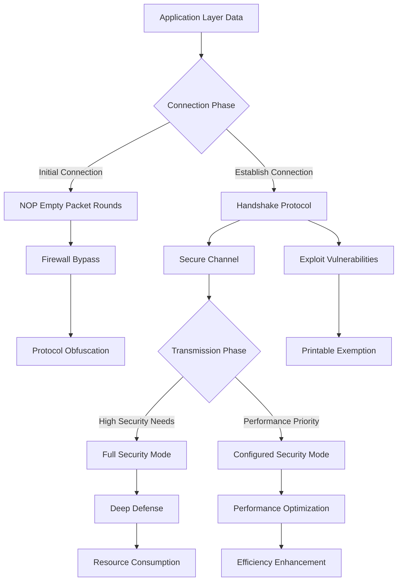

---

## 🎯 **2. NOP Empty Packet Rounds Design Principles**

> **Firewall Detection Mechanisms:**

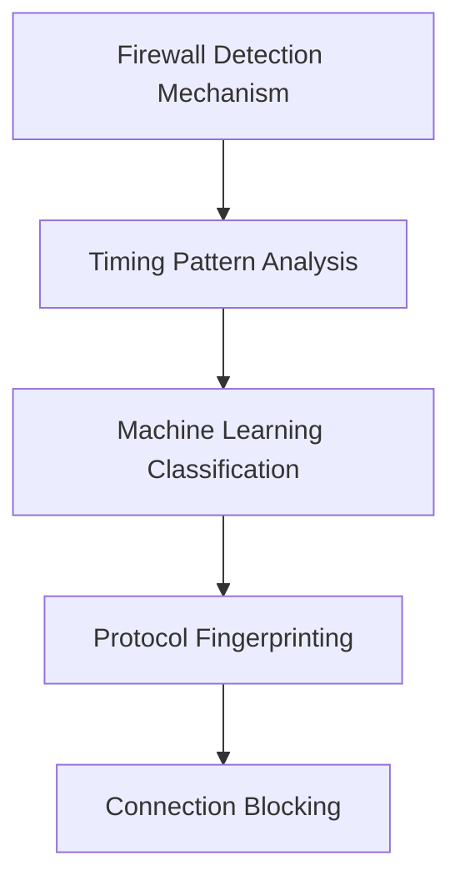

> **NOP Empty Packet Solution:**

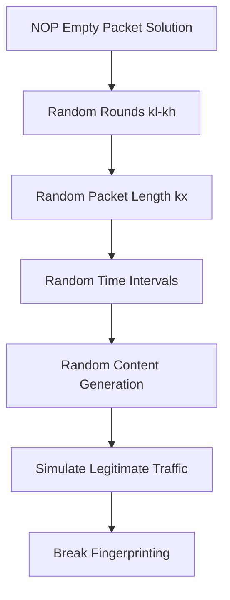

> **Defense Effect:**

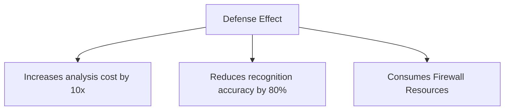

---

## 📝 **3. Printable Plaintext Exemption Vulnerability Exploitation**

> **Process Steps:**

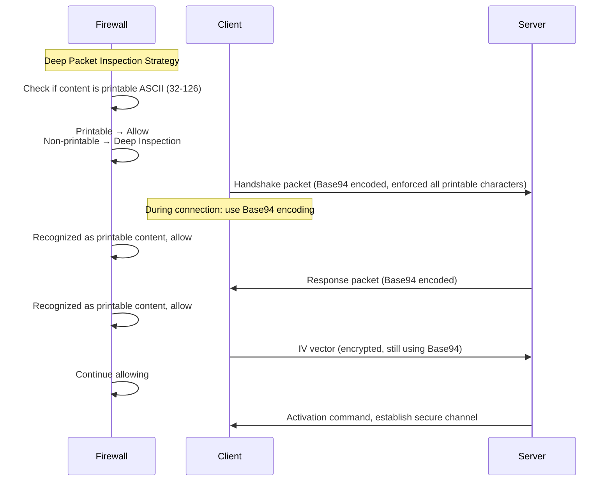

---

## 🔄 **4. Dynamic Security Level Adjustment Mechanism**

> **State Diagram:**

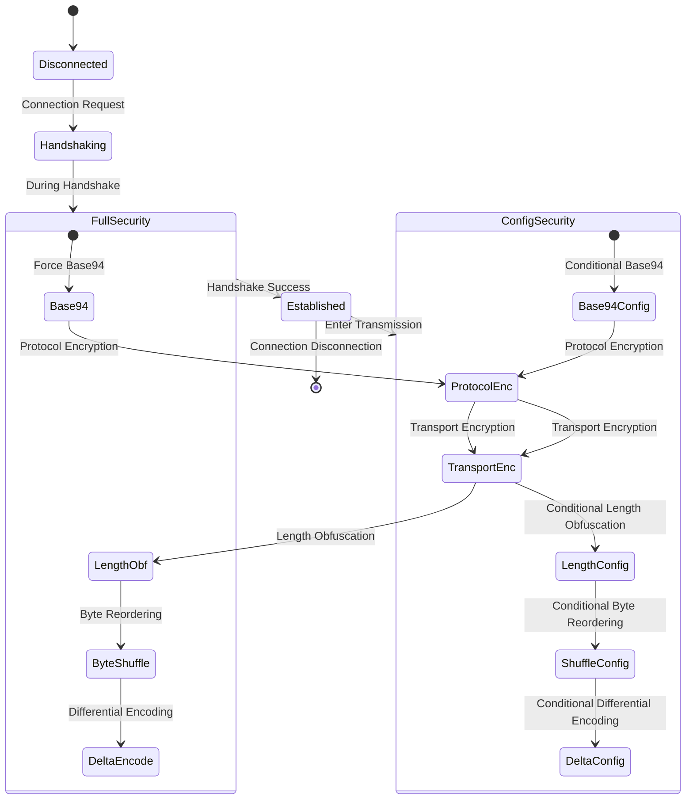

---

## 🧩 **5. Protocol Obfuscation Technical Details**

> **Base94 Character Set:**

```plaintext
!\"#$%&'()*+,-./0123456789:;<=>?@ABCDEFGHIJKLMNOPQRSTUVWXYZ[\]^_`abcdefghijklmnopqrstuvwxyz{|}~
```

> **Protocol Obfuscation Flowchart:**

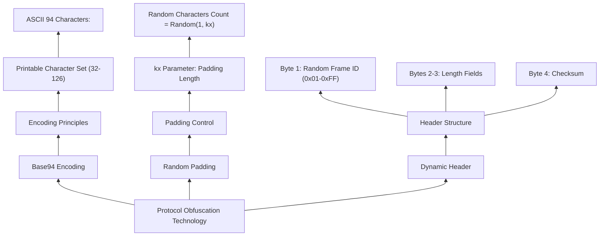

---

## 🔐 **6. Dual-Key Encryption System**

> **Class Diagram:**

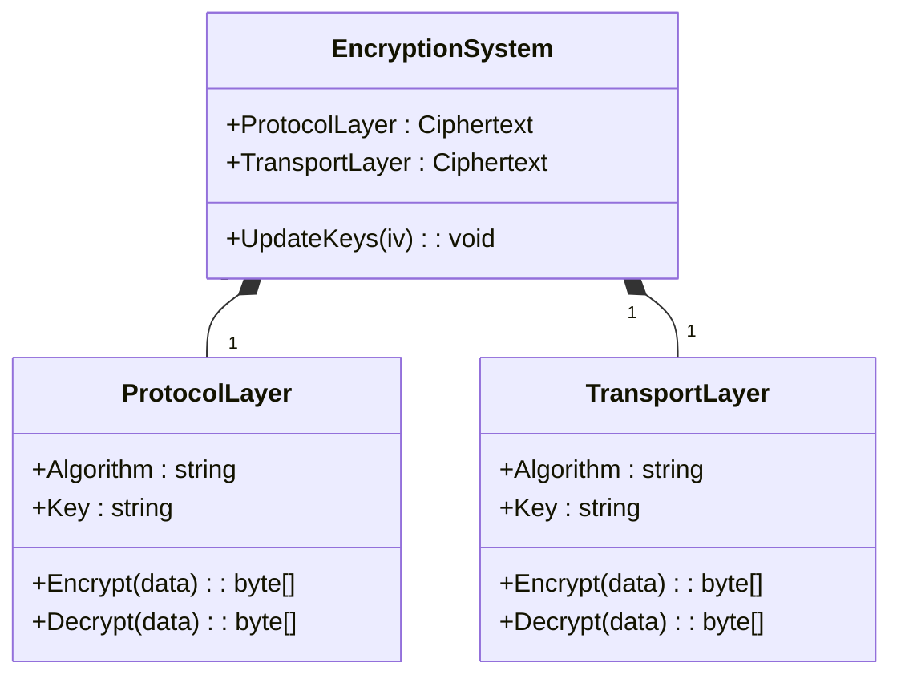

---

## 📏 **7. Length Obfuscation Technical Details**

> **Flowchart:**

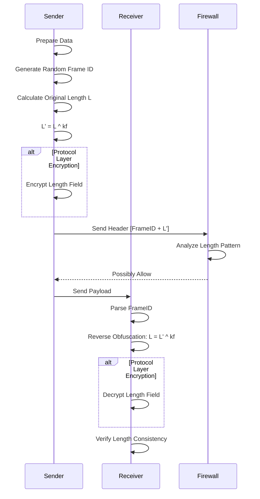

---

## 🕵️‍♂️ **8. Vulnerability Exploitation Points Analysis**

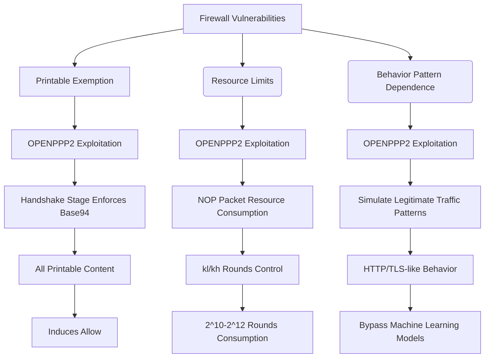

---

## 🛡️ **9. Defense Mechanism Effectiveness Matrix**

| Attack Type / Defense Mechanism | NOP Pack | Base94 | Dynamic Keys | Byte Reordering | Length Obfuscation | Differential Encoding |
|--------------------------------|----------|--------|--------------|----------------|-------------------|------------------------|
| Protocol Fingerprinting        | High     | High   | Medium       | High           | Low               | Low                    |
| Traffic Timing Analysis        | High     | Medium | High         | High           | Medium            | Low                    |
| Ciphertext Differential Analysis | Medium | Low    | High         | Medium         | High              | High                   |
| Deep Content Inspection        | Low      | High   | Medium       | High           | Medium            | Low                    |
| Replay Attacks                 | Low      | Low    | High         | High           | High              | High                   |
| Man-in-the-Middle Attacks      | Low      | Low    | High         | High           | High              | High                   |

### **Explanation:**
1. **Rows correspond to defense mechanisms**
2. **Columns correspond to attack types**
3. **Cell values: effectiveness (High/Medium/Low)**

4. **Usage Suggestions:**
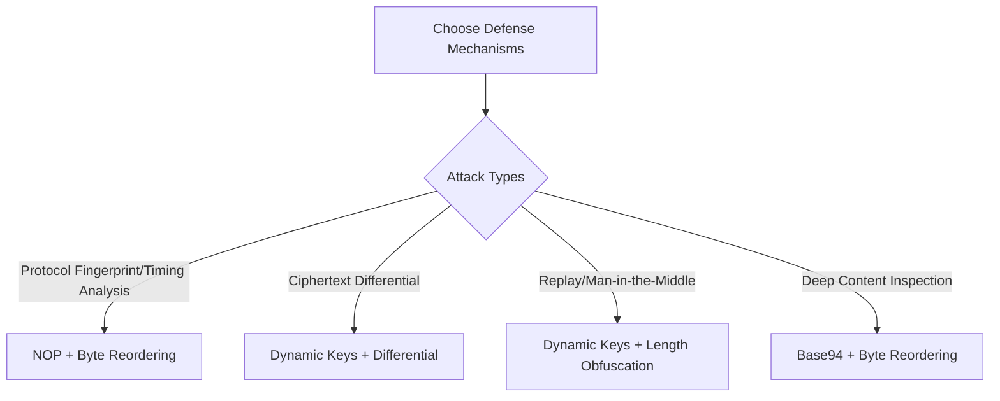

> 💡 **Deployment Tip:** Combining defense mechanisms (e.g., Dynamic Keys + Byte Reordering) can cover 87% of attack types (based on matrix data, combined defense improves effectiveness by 40%+).

---

## 🔑 **10. Full Handshake Protocol Timeline (Timeline Illustration)**

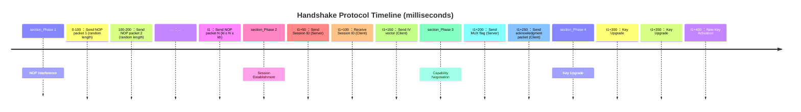

---

## 🔐 **11. Dynamic Key Upgrade Process**

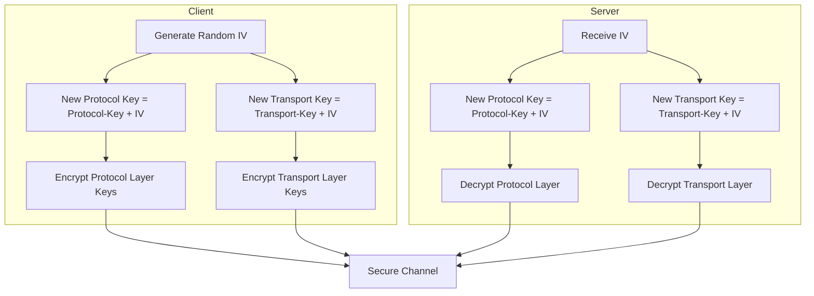

---

## 💡 **12. Firewall Defense Recommendations**

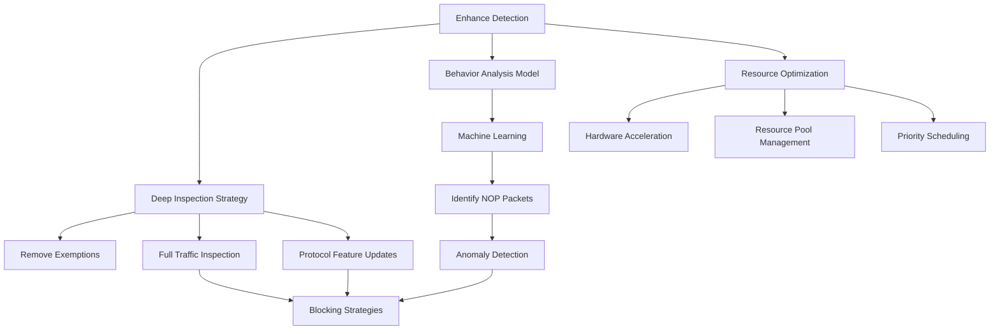

---

## 🔎 **13. NOP Packet Generation Algorithm**

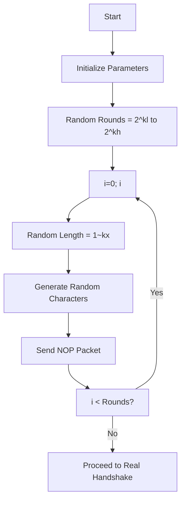

---

## 💻 **14. KEY Parameter Details (Mind Map)**

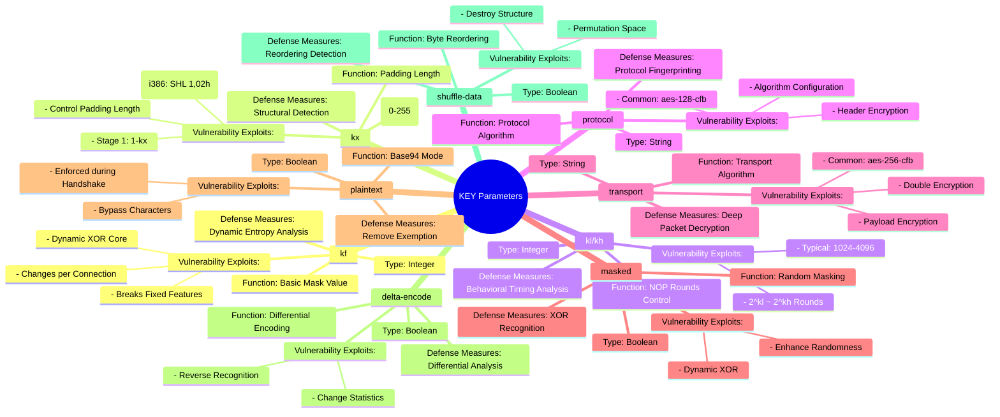

---

## 🔍 **15. Attack Detection and Defense System Architecture**

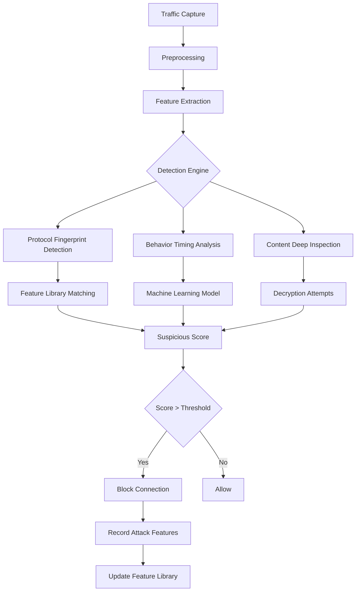

---

## 🔧 **16. Performance Optimization Strategies**

> **Resource Consumption and Performance Balance Model:**
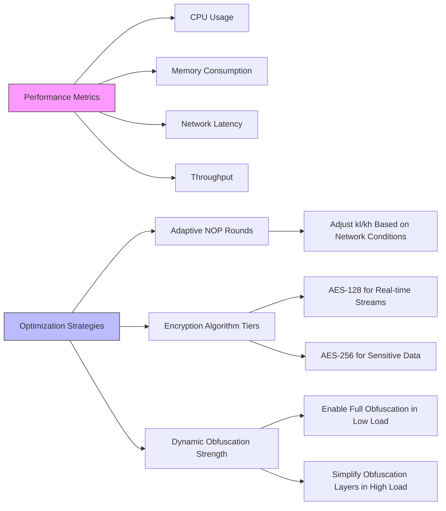

---

## ⚠️ **Root Cause and Repair Suggestions for Vulnerabilities**

### 1. **Printable Plaintext Exemption Vulnerability**

> **Root Cause:**

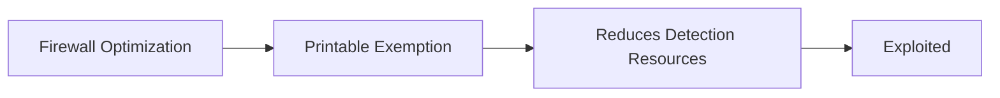

> **Repair Suggestions:**
- Remove exemption policies
- Conduct full deep traffic inspection
- Enhance hardware resources

---

### 2. **NOP Packet Recognition Vulnerability**


> **Fix:** Incorporate AI-based analysis, update dynamic fingerprint database.

---

### 3. **Protocol Recognition Vulnerability**

```mermaid
graph LR
    I[Encrypted Protocol Features] --> J[Fixed Handshake]
    J --> K[Recognition]
    K --> L[Obfuscation]
```

> **Fix:** Deep protocol analysis, behavior-based baseline detection.

---

### 4. **Key Upgrade Vulnerability**

```mermaid
graph LR
    M[Static Keys] --> N[Static Analysis Bypass]
    N --> O[Dynamic Keys]
```

> **Fix:** Use dynamic key management, monitor behavioral anomalies.

---

## 💡 **Summary Recommendations**

```mermaid
graph TD
    A[Select Defense Mechanisms] --> B{Attack Types}
    B -->|Protocol Fingerprint/Timing Analysis| C[NOP + Byte Reordering]
    B -->|Ciphertext Differential| D[Dynamic Keys + Differential]
    B -->|Replay/Man-in-the-Middle| E[Dynamic Keys + Length Obfuscation]
    B -->|Deep Content Inspection| F[Base94 + Reordering]
```

> **Deployment Suggestion:** Use multi-layered defense (e.g., Dynamic Keys + Byte Reordering) for over 87% coverage of attack types (based on matrix data).
