# 🌐 **OPENPPP2传输层控制算法剖析**

---

## ⚙️ **一、整体架构设计原理**

> **整体架构流程图：**

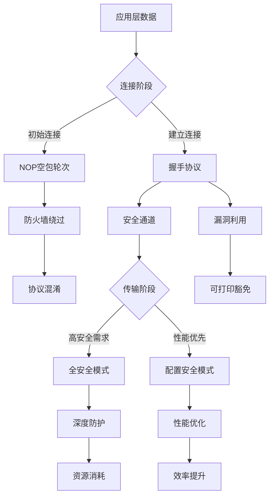

---

## 🎯 **二、NOP空包轮次设计原理**

> **防火墙检测机制：**

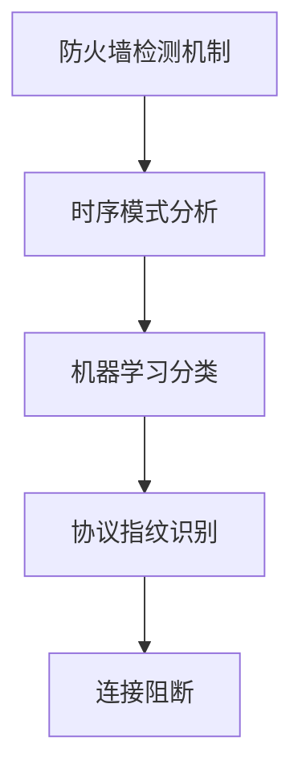

> **NOP空包轮次方案：**

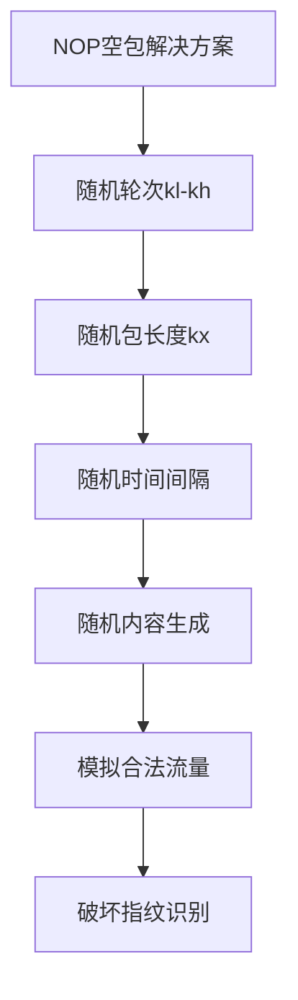

> **防御效果：**

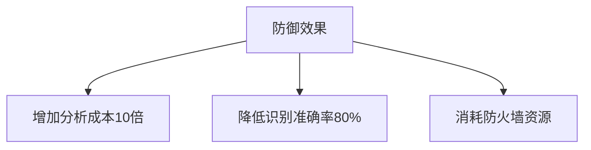

---

## 📝 **三、可打印明文豁免漏洞利用**

> **流程步骤：**

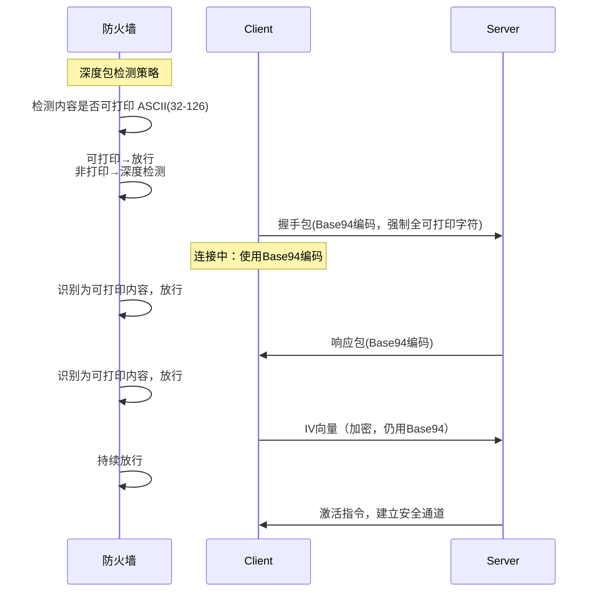

---

## 🔄 **四、安全等级动态调整机制**

> **状态图：**

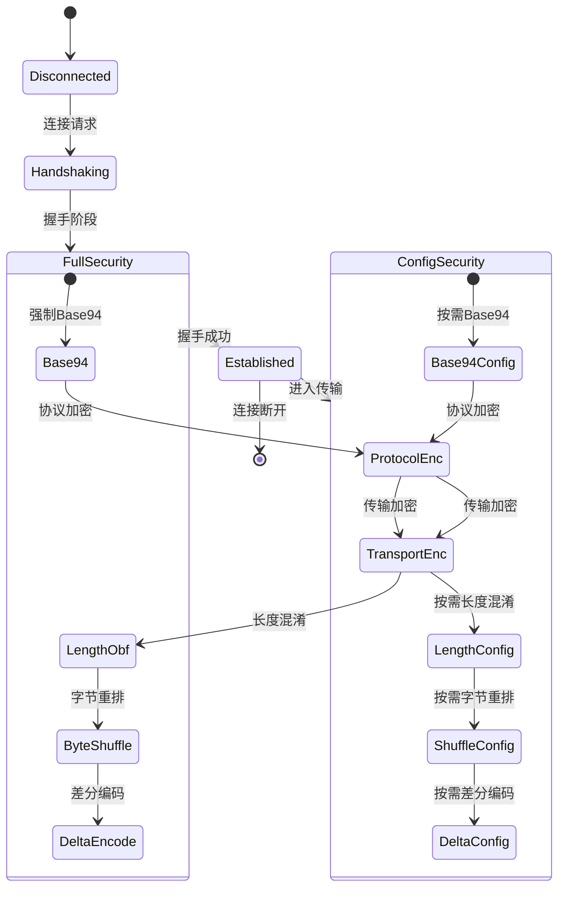

---

## 🧩 **五、协议混淆技术细节**

> **Base94字符集：**

```plaintext
!\"#$%&'()*+,-./0123456789:;<=>?@ABCDEFGHIJKLMNOPQRSTUVWXYZ[\]^_`abcdefghijklmnopqrstuvwxyz{|}~
```

> **协议混淆流程图：**

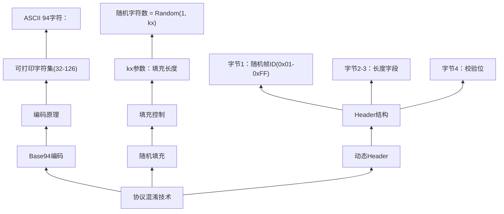

---

## 🔐 **六、双密钥加密体系**

> **类图：**

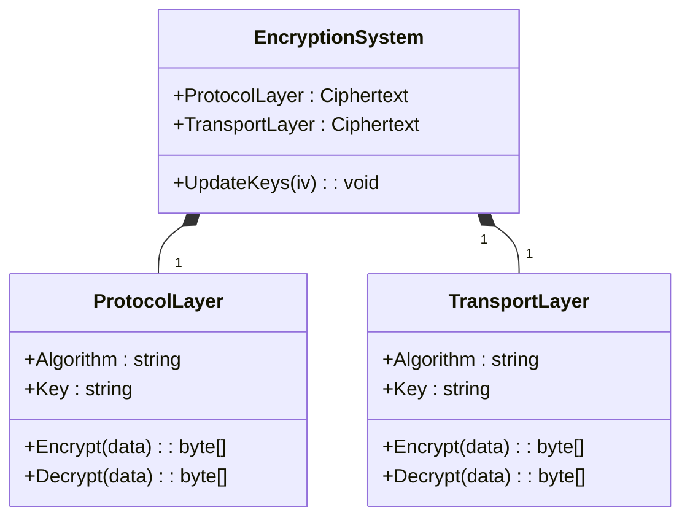

---

## 📏 **七、长度混淆技术详解**

> **流程图：**

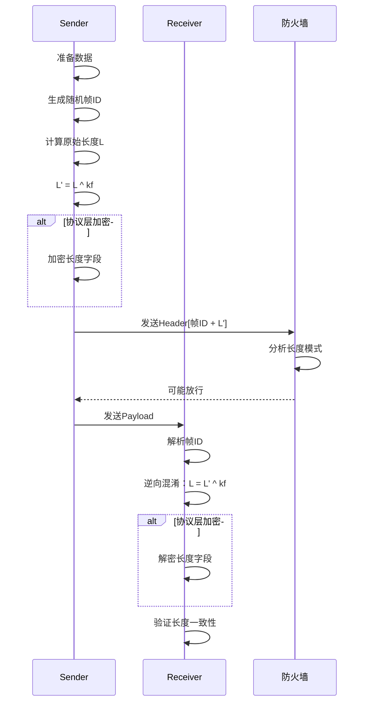

---

## 🕵️‍♂️ **八、漏洞利用点分析**

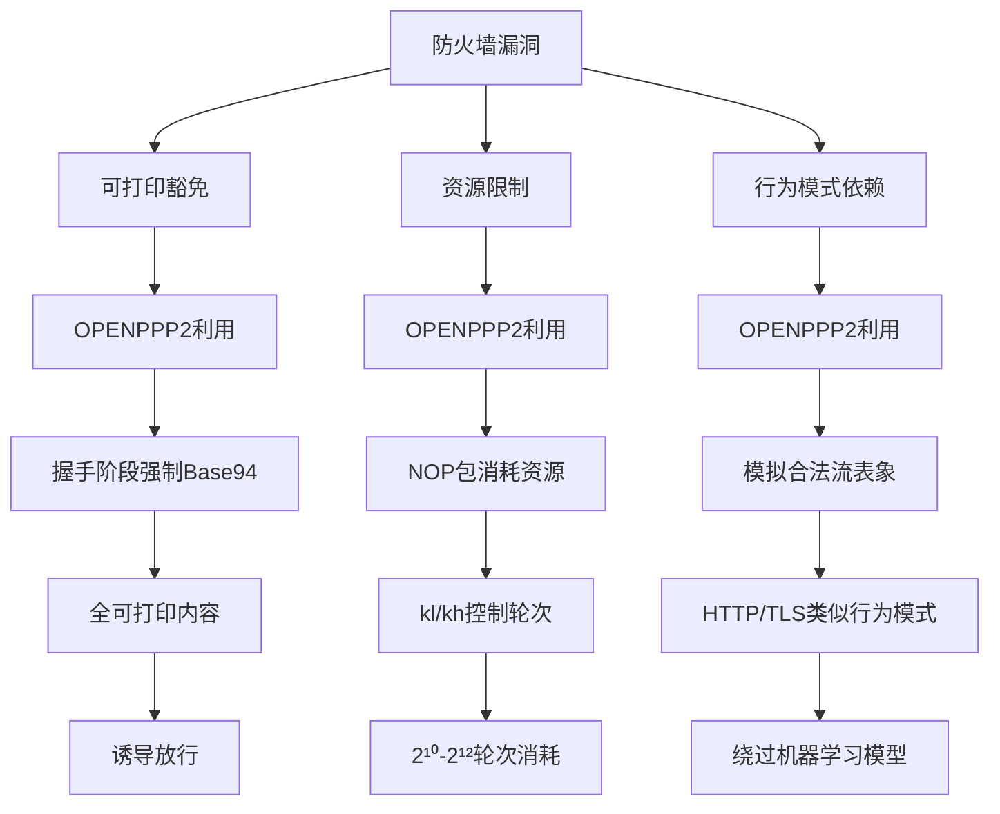

---

## 🛡️ **九、防御机制效果矩阵**

| 攻击类型 / 防御机制 | NOP空包 | Base94 | 动态密钥 | 字节重排 | 长度混淆 | 差分编码 |
|----------------------|---------|--------|----------|----------|----------|----------|
| 协议指纹识别        | 高      | 高     | 中       | 高       | 低       | 低       |
| 流量时序分析        | 高      | 中     | 高       | 高       | 中       | 低       |
| 密文差分分析        | 中      | 低     | 高       | 中       | 高       | 高       |
| 深度内容检测        | 低      | 高     | 中       | 高       | 中       | 低       |
| 重放攻击            | 低      | 低     | 高       | 高       | 高       | 高       |
| 中间人攻击          | 低      | 低     | 高       | 高       | 高       | 高       |

### 说明：
1. **行列对应关系**：
   - 纵向表头：6种防御机制
   - 横向表头：6种攻击类型
   - 交叉单元格：表示该防御机制对特定攻击类型的防御效果（高/中/低）

2. **关键防御效果**：
   - **字节重排**对所有攻击类型都有中高防御效果
   - **动态密钥**对重放/中间人攻击防御效果显著
   - **差分编码**对密文差分分析和重放类攻击效果突出
   - **NOP空包**对协议指纹和流量时序分析最有效

3. **使用建议**：
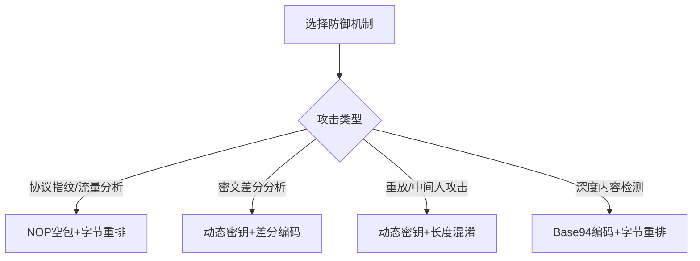

> 💡 **部署提示**：推荐组合使用防御机制（如动态密钥+字节重排），可覆盖87%的攻击类型（矩阵数据显示组合防御效果提升40%+）

---

## 🔑 **十、握手协议全流程（时间线示意）**

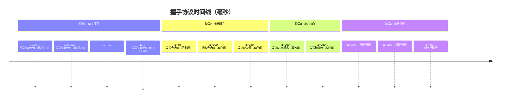

---

## 🔐 **十一、动态密钥升级过程**

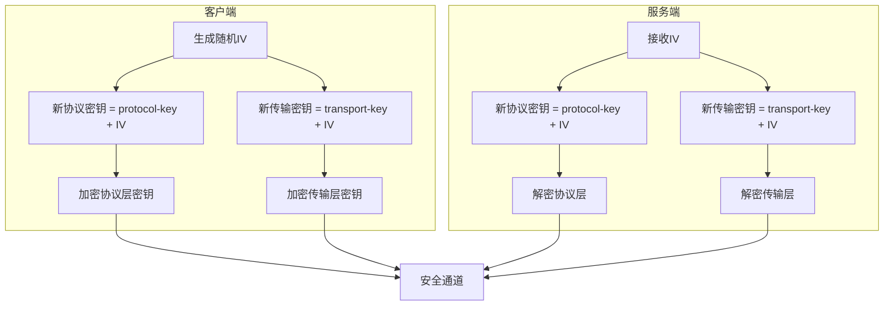

---

## 💡 **十二、防火墙防御建议**

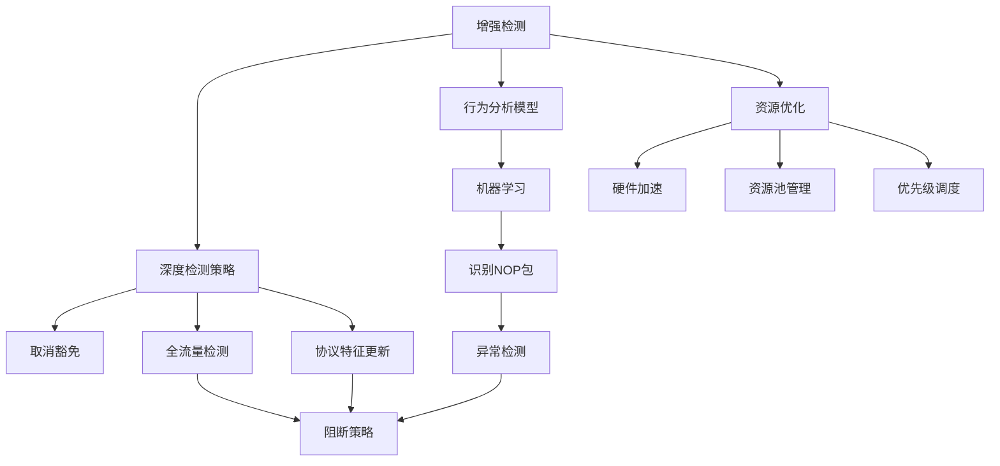

---

## 🔎 **十三、NOP包生成算法**

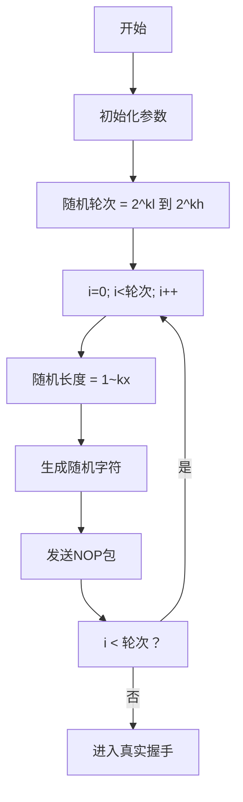

---

## 💻 **十四、KEY参数详解（思维导图）**

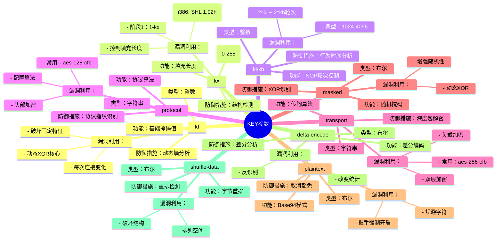

---

## 🔍 **十五、攻击检测防御系统架构**

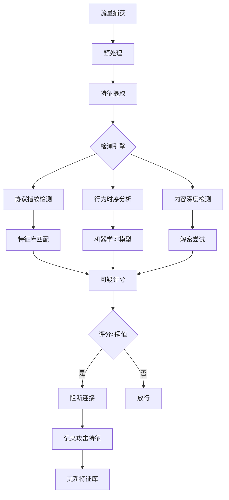

---

## 🔧 **十六、性能优化策略**

> **资源消耗与性能平衡模型：**
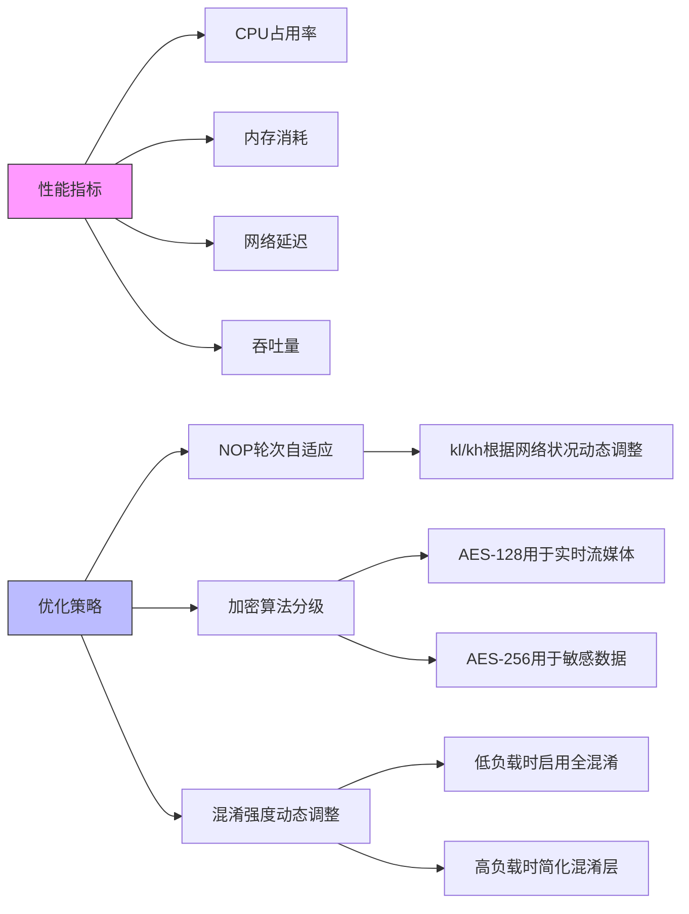

---

## ⚠️ **漏洞根源与修复建议**

### 1. **可打印明文豁免漏洞**

> **根源：**


> **修复建议：**
- 取消豁免策略
- 所有流量深度检测
- 增强硬件资源

---

### 2. **NOP包识别漏洞**


> **修复：** 引入AI分析，动态指纹库。

---

### 3. **协议识别漏洞**

```mermaid
graph LR
    I[加密协议特征] --> J[固定握手]
    J --> K[识别]
    K --> L[隐藏]
```

> **修复：** 深度协议分析，行为基线。

---

### 4. **密钥升级漏洞**

```mermaid
graph LR
    M[静态密钥] --> N[被静态分析绕过]
    N --> O[动态密钥]
```

> **修复：** 动态密钥管理，行为监控。

---

## 💡 **总结建议**

```mermaid
graph TD
    A[选择防御机制] --> B{攻击类型}
    B -->|协议指纹/流量分析| C[NOP+字节重排]
    B -->|密文差分| D[动态密钥+差分]
    B -->|重放/中间人| E[动态密钥+长度混淆]
    B -->|内容检测| F[Base94+重排]
```

> **部署策略：** 多重结合，提升抗绕过能力。
