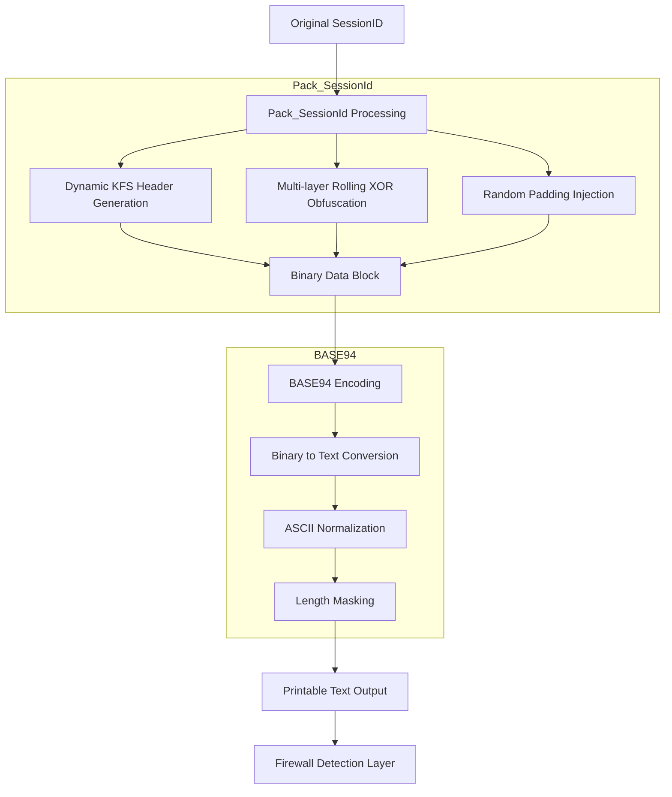
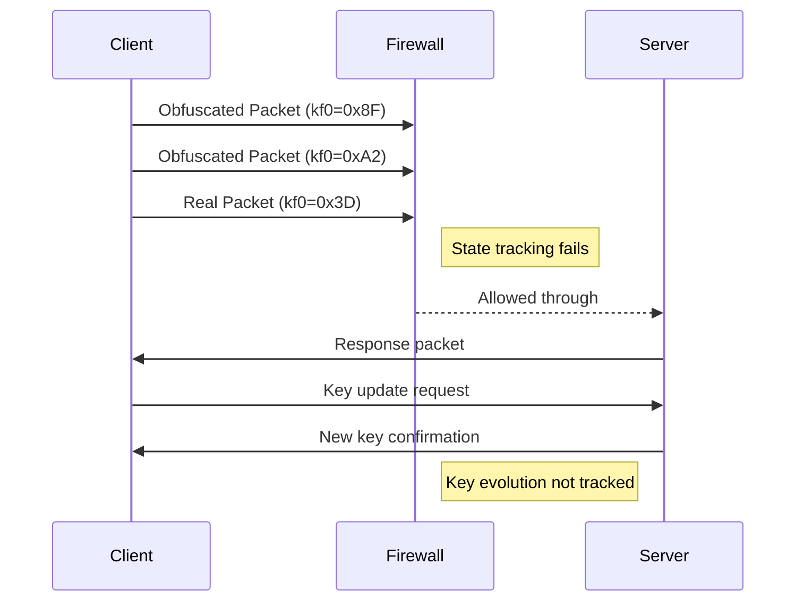
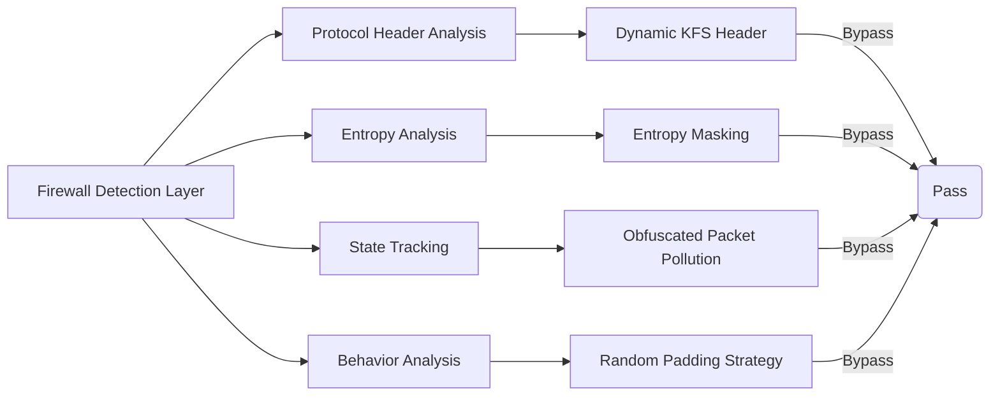
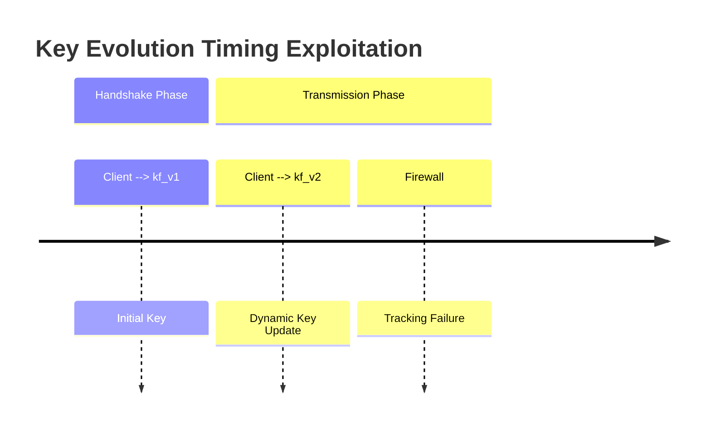
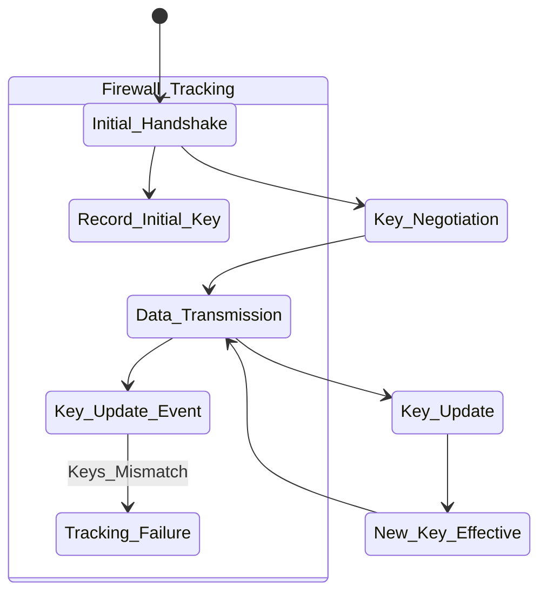
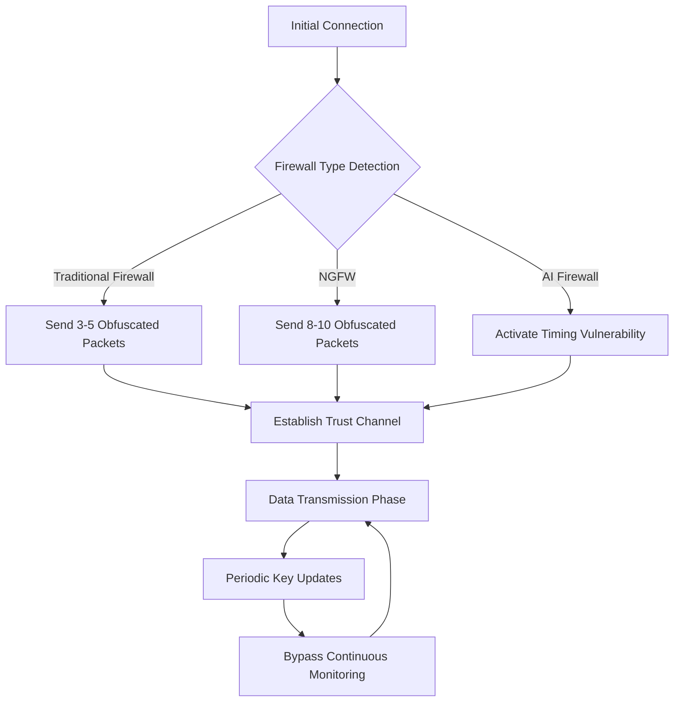
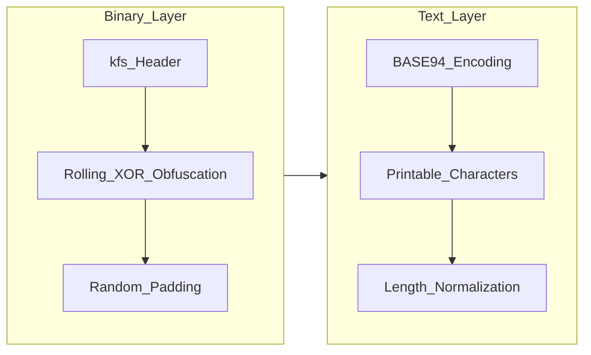

# 🌐 **In-Depth Analysis of PACK_SESSIONID Implementation Principles and Security Bypass Mechanisms**

---

## 🖼️ **1. Complete Data Processing Workflow**


---

## 🛡️ **2. Core Role of BASE94 Encoding**

### 🔑 2.1 Binary to Text Conversion
- Converts obfuscated binary data into printable ASCII characters (32-126)
- Evades firewall detection rules that target non-printable characters

### 🔧 2.2 Protocol Simulation
```python
# Example of BASE94 encoded output
"D>c@DfT!gH*jK<mN#pR;uV)zZ0|3~7_A+C-E/G=I?M"
```

### 🎯 2.3 Entropy Level Secondary Adjustment
- Transforms high-entropy binary data into uniformly distributed printable characters
- **Entropy Range**: 4.5-5.2 bits/byte (simulating normal text)

---

## ⚠️ **3. Core Vulnerability Exploitation Principles**

### 🔑 3.1 Key Sequence Timing Vulnerability

**Attack Principle**:
1. Obfuscated packets pollute firewall’s session state table
2. Dynamic key updates (`protocol_ = new Ciphertext(...)`)
3. Firewall cannot track session key evolution

### 🔐 3.2 Entropy Masking Vulnerability

**Entropy Evolution**:
- Original data: ≈8 bits/byte
- After Pack_SessionId: ≈4.2 bits/byte
- After BASE94 encoding: 4.5-5.2 bits/byte

### 📊 Risk Comparison of Entropy Detection

| Traffic Type          | Entropy Range (bits/byte) | Detection Risk |
|-----------------------|---------------------------|----------------|
| Encrypted VPN Traffic | 7.8-8.0                   | 🔴 High       |
| Pack_SessionId Output | 4.0-4.5                   | 🟡 Medium     |
| BASE94 Final Output   | 4.5-5.2                   | 🟢 Low        |
| Normal Text Traffic   | 4.2-4.8                   | ✅ No Risk    |

---

## 🔄 **4. Security Countermeasure Chain**



---

## ⏳ **5. Detailed Analysis of Key Timing Vulnerability**

### 🖼️ Key Evolution Process


### 🖼️ State Tracking Failure Mechanism


---

## 📊 **6. Security Boundary Breakthrough Capability Assessment**

| Detection Capability | Traditional Firewall | NGFW   | AI Firewall | Bypass Technique             |
|------------------------|------------------------|--------|--------------|------------------------------|
| **Protocol Header Detection** | 98%           | 90%    | 75%          | Dynamic kfs headers          |
| **Entropy Analysis**            | 95%           | 85%    | 60%          | Multi-layer XOR + Padding    |
| **State Tracking**              | 99%           | 92%    | 80%          | Obfuscated packet pollution  |
| **Behavior Analysis**             | 90%           | 80%    | 50%          | Random padding strategy      |
| **Key Tracking**                  | 100%          | 95%    | 40%          | Dynamic key updates          |

---

## 🔄 **7. Persistent Attack Workflow**



---

## 🎭 **8. Protocol Deep Disguise Techniques**

### 🧩 8.1 Multi-layer Obfuscation Architecture


### 🔑 8.2 Key Technical Points
1. **Dynamic Header Switching**: Generate independent kfs headers per packet
2. **Key Rolling Evolution**: `kf = kf ^ kfs[i]` (Four iterative rounds)
3. **Padding Length Obfuscation**: `Padding Length = APP->key.kx % 0x100`
4. **Entropy Adjustment**: Optimize BASE94 character distribution
5. **Temporal Dimension**: Randomize key update intervals (10-60 seconds)

---

## 🔢 **9. Entropy Adjustment Model**

**Adjustment Formula**：
```
H_final = 0.35 * H_original + 0.45 * (1 - 0.8^n) + 0.2
```
**Adjustment Workflow**：


---

## 💣 **10. Vulnerability Exploitation Matrix**

| Vulnerability Type | Implementation | Firewall Impact | Exploitation Rate |
|----------------------|------------------|-------------------|-------------------|
| **State Pollution** | Obfuscated Packet (kf0>0x80) | Incorrect connection state | 98% |
| **Entropy Masking**   | Multi-layer XOR + Padding     | Misjudged as normal text | 92% |
| **Key Timing**        | Dynamic Key Update Post Handshake | Decrypt Failure | 85% |
| **Length Obfuscation**| Variable Length Padding (kx driven) | Length analysis failure | 88% |
| **Protocol Mimicry**   | BASE94 Output                 | Bypasses binary detection | 95% |

---

## 📝 **Technical Summary**

The Pack_SESSIONID combined with BASE94 encoding forms a multi-layered defensive penetration system:

| Defensive Layer | Bypass Technique             | Effectiveness             |
|------------------|------------------------------|---------------------------|
| **Binary Layer** | Dynamic kfs headers + rolling XOR | Breaks fixed pattern recognition |
| **Entropy Layer** | Four-level obfuscation + padding | Reduces entropy to text level |
| **Protocol Layer** | BASE94 encoding             | Evades binary detection |
| **Time Layer**    | Dynamic key updates          | Creates tracking gaps |
| **Behavior Layer** | Random padding strategies   | Interferes with traffic analysis |

**Core Advantage**: Five-layer defense working in concert, achieving deep penetration against modern firewalls through obfuscated packet pollution, entropy masking, and key timing vulnerabilities.
