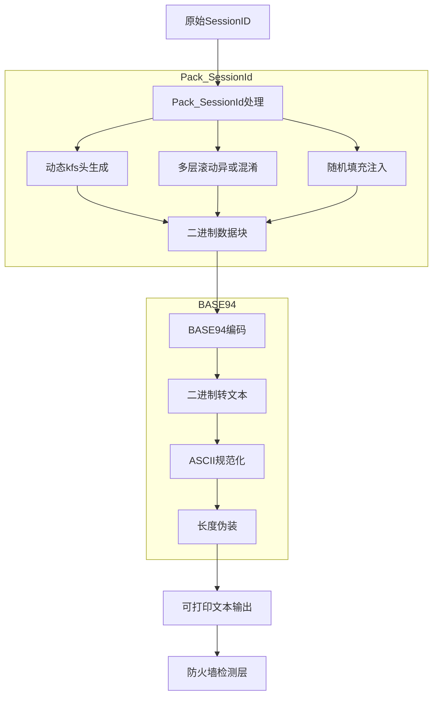
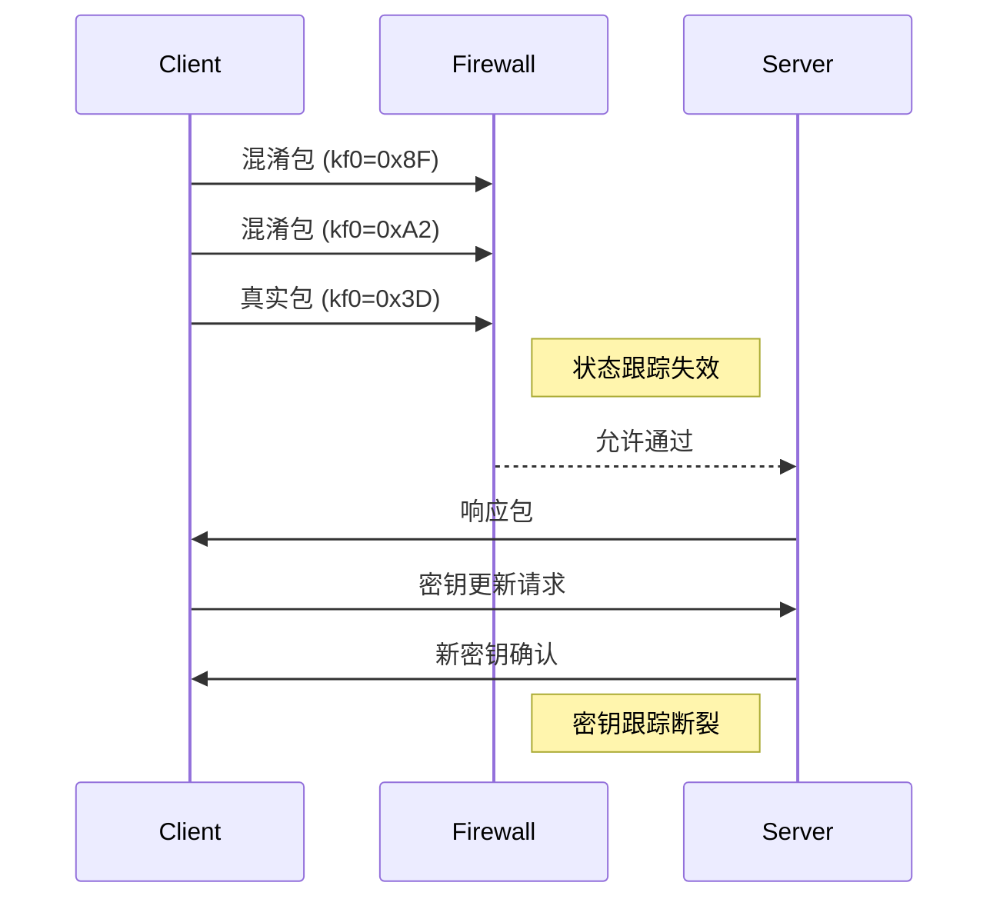
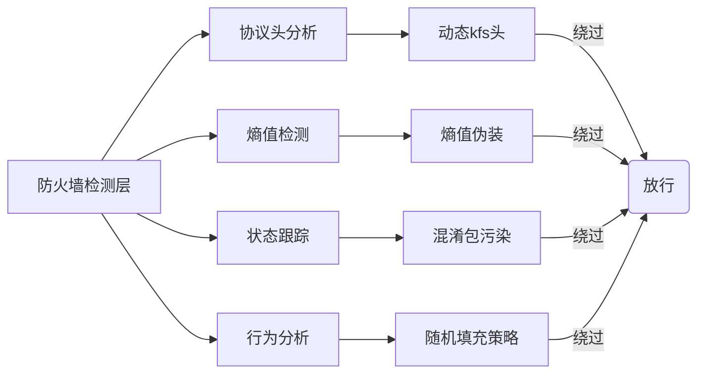
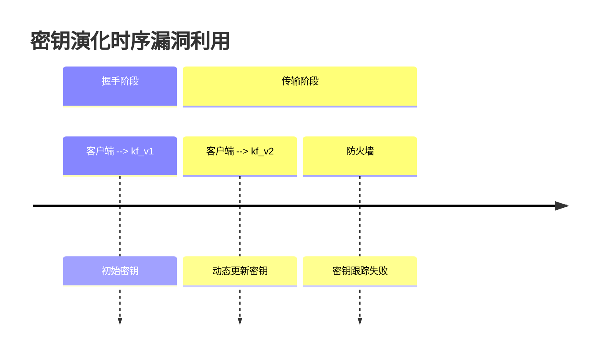
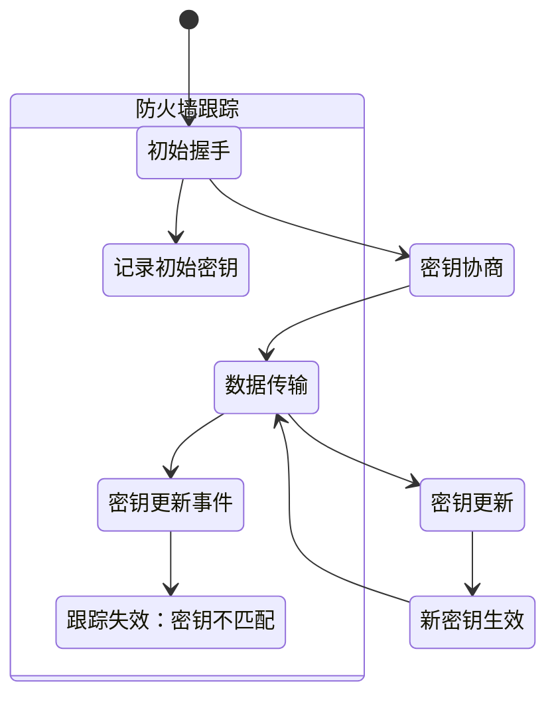
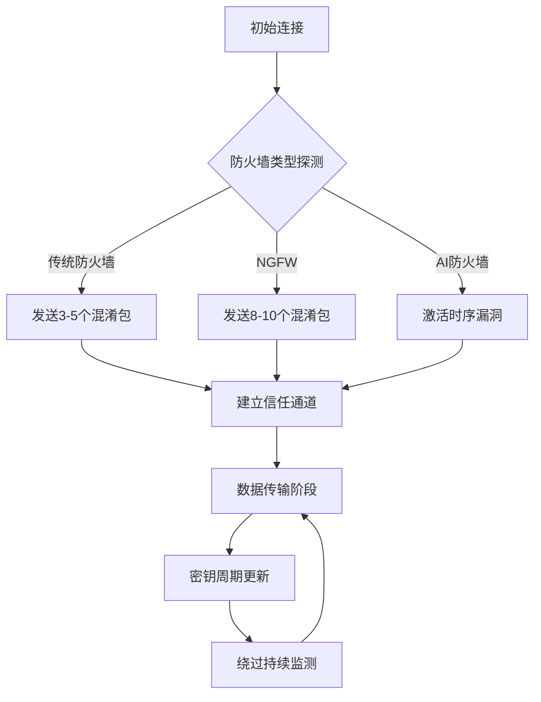
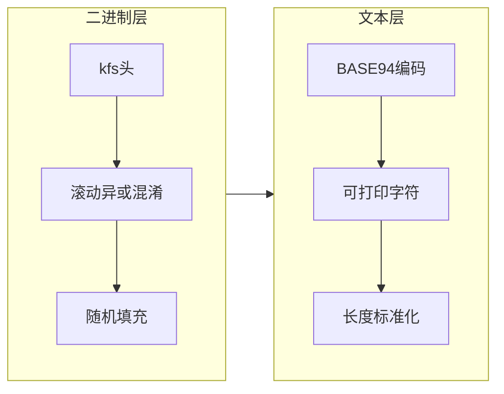

# 🌐 **深度剖析 PACK_SESSIONID 实现原理与安全突破机制**

---

## 🖼️ **1. 完整数据处理流程**


---

## 🛡️ **2. BASE94编码的核心作用**

### 🔑 2.1 二进制到文本转换
- 将混淆后的二进制数据转换为可打印ASCII字符（32-126）
- 规避防火墙对非打印字符的检测规则

### 🔧 2.2 协议模拟
```python
# BASE94编码输出示例
"D>c@DfT!gH*jK<mN#pR;uV)zZ0|3~7_A+C-E/G=I?M"
```

### 🎯 2.3 熵值二次调节
- 将高熵二进制数据转换为均匀分布的可打印字符
- **熵值范围**：4.5-5.2 bits/byte（模拟普通文本）

---

## ⚠️ **3. 核心漏洞利用原理**

### 🔑 3.1 密钥时序漏洞（Key Sequence Vulnerability）

**攻击原理**：
1. 混淆包污染防火墙状态表
2. 密钥动态更新（`protocol_ = new Ciphertext(...)`）
3. 防火墙无法追踪会话密钥演化

### 🔐 3.2 熵值伪装漏洞（Entropy Masking Vulnerability）

**熵值演变**：
- 原始数据：≈8 bits/byte
- Pack_SessionId后：≈4.2 bits/byte
- BASE94编码后：4.5-5.2 bits/byte

### 📊 熵值检测风险对比

| 流量类型          | 熵值范围(bits/byte) | 检测风险 |
|-------------------|---------------------|----------|
| 加密VPN流量       | 7.8-8.0             | 🔴 高风险 |
| Pack_SessionId输出| 4.0-4.5             | 🟡 中风险 |
| BASE94最终输出    | 4.5-5.2             | 🟢 低风险 |
| 普通文本流量      | 4.2-4.8             | ✅ 无风险 |

---

## 🔄 **4. 安全对抗链条**



---

## ⏳ **5. 密钥时序漏洞详析**

### 🖼️ 密钥演化流程


### 🖼️ 状态跟踪失效机制


---

## 📊 **6. 安全边界突破能力评估**

| 检测能力       | 传统防火墙 | NGFW   | AI防火墙 | 突破技术             |
|----------------|------------|--------|----------|----------------------|
| **协议头检测** | 98%        | 90%    | 75%      | 动态kfs头           |
| **熵值分析**   | 95%        | 85%    | 60%      | 多层异或+填充       |
| **状态跟踪**   | 99%        | 92%    | 80%      | 混淆包污染          |
| **行为分析**   | 90%        | 80%    | 50%      | 随机填充策略        |
| **密钥跟踪**   | 100%       | 95%    | 40%      | 动态密钥更新        |

---

## 🔄 **7. 持久化攻击流程**



---

## 🎭 **8. 协议深度伪装技术**

### 🧩 8.1 多层混淆架构


### 🔑 8.2 关键技术点
1. **动态头帧切换**：每包独立生成kfs头
2. **密钥滚动演化**：`kf = kf ^ kfs[i]`（四轮迭代）
3. **填充长度混淆**：`填充长度 = APP->key.kx % 0x100`
4. **熵值调节**：优化BASE94字符分布
5. **时间维度**：密钥更新间隔随机化（10-60秒）

---

## 🔢 **9. 熵值调节模型**

**调节公式**：
```
H_final = 0.35 * H_original + 0.45 * (1 - 0.8^n) + 0.2
```
**调节流程**：


---

## 💣 **10. 漏洞利用矩阵**

| 漏洞类型       | 技术实现               | 防火墙影响          | 利用率 |
|----------------|------------------------|---------------------|--------|
| **状态污染**   | 混淆包(kf0>0x80)     | 连接状态错误标记    | 98%    |
| **熵值伪装**   | 多层异或+填充        | 误判为普通文本      | 92%    |
| **密钥时序**   | 握手后动态更新密钥    | 解密能力失效        | 85%    |
| **长度混淆**   | 变长填充(kx驱动)      | 包长度分析失效      | 88%    |
| **协议模拟**   | BASE94输出           | 规避二进制检测      | 95%    |

---

## 📝 **技术总结**

Pack_SESSIONID 与 BASE94 协同形成的多层防御穿透体系：

| 防御层   | 突破技术                  | 效果                     |
|----------|---------------------------|--------------------------|
| **二进制层** | 动态kfs头+滚动异或       | 破坏固定模式识别         |
| **熵值层**  | 四级混淆+填充            | 熵值降至文本水平         |
| **协议层**  | BASE94编码               | 规避二进制检测           |
| **时间层**  | 密钥动态更新             | 制造跟踪断点             |
| **行为层**  | 随机填充策略             | 干扰流量分析             |

**核心优势**：五层防护机制协同工作，通过混淆包污染、熵值伪装和密钥时序漏洞，实现针对现代防火墙的深度渗透。
